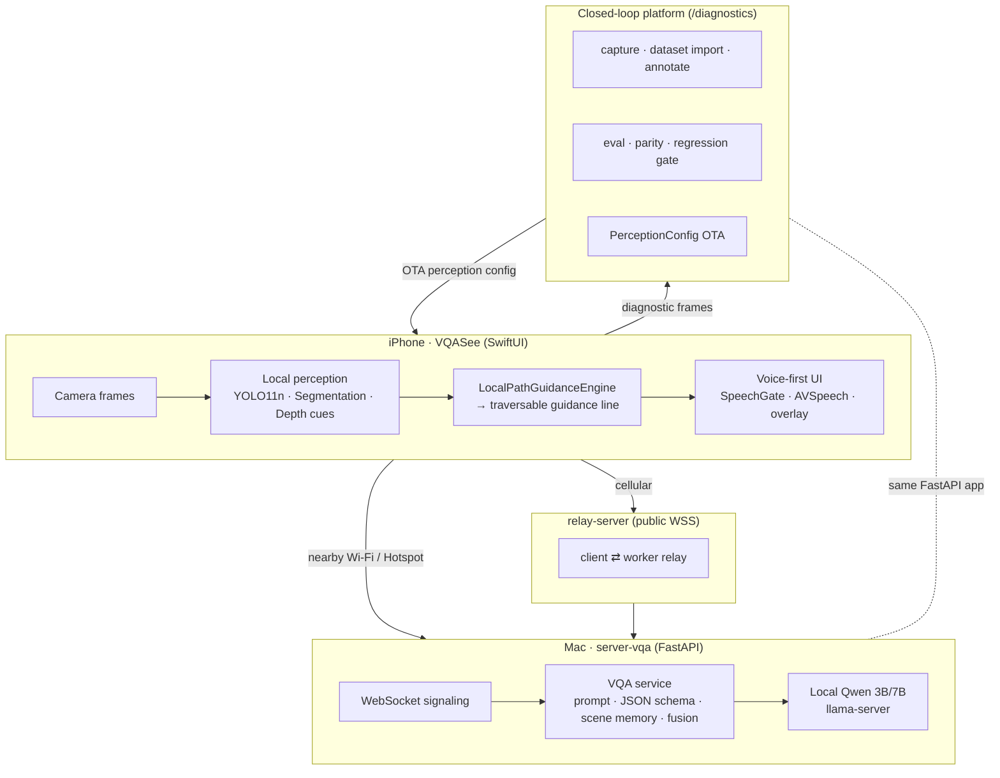
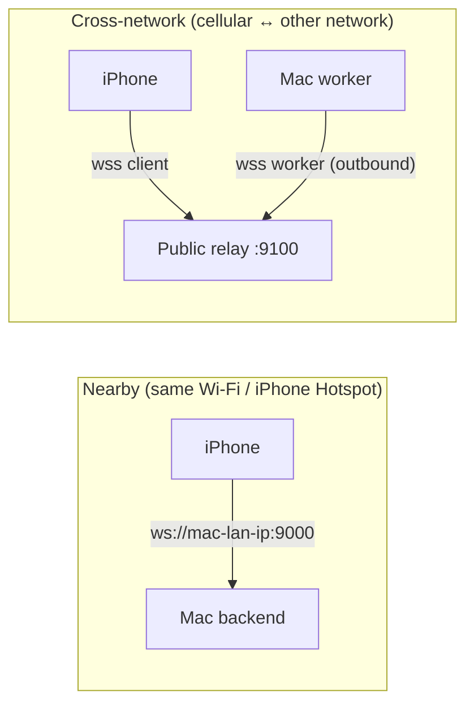
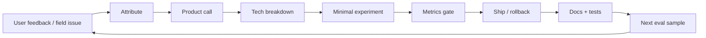
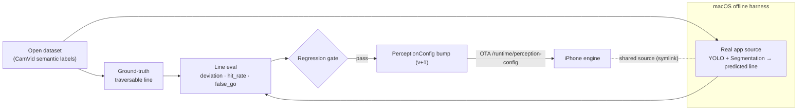

<!-- Language switch -->
**English** · [简体中文](README.md)

# VQASee — Vision-first Risk & Path Assistance for iPhone

> Pick up your phone, and *see* the path, obstacles, boundaries and risks around
> you — with voice to confirm, not replace, your own attention.

VQASee is a vision-first risk-assistance and traversable-path app for iPhone. It
serves people who are walking, cycling, driving, commuting, reading signs, or
whose attention may be split and who want an extra visual reminder. It aims to be
**usable, pleasant, practical and trustworthy** — an assistant that surfaces
risk, boundaries and uncertainty, but never claims a path is safe and never
replaces the user's own judgement.

The repo is not just the app: it also contains a **closed-loop evolution
platform** that turns real usage, model evals, latency data and code verification
into the next iteration of the product.

---

## Table of contents

- [What's inside](#whats-inside)
- [System architecture](#system-architecture)
- [Runtime paths (nearby vs relay)](#runtime-paths-nearby-vs-relay)
- [The closed-loop evolution platform](#the-closed-loop-evolution-platform)
- [Traversable guidance line](#traversable-guidance-line)
- [On-device experience](#on-device-experience)
- [Repository layout](#repository-layout)
- [Quick start](#quick-start)
- [Local Qwen runtime](#local-qwen-runtime)
- [Testing](#testing)
- [Knowledge base](#knowledge-base)
- [Principles](#principles)

---

## What's inside

| Layer | What it does | Where |
|---|---|---|
| **iOS app** | SwiftUI camera app, voice-first UI, on-device perception (YOLO11n + segmentation + depth cues), guidance line, mode bar | `ios-vqa-app/VQASee` |
| **VQA backend** | FastAPI service: WebSocket signaling, prompt/schema, scene memory, Qwen 3B/7B via `llama-server`, fusion fallback | `server-vqa/app` |
| **Closed-loop platform** | Diagnostic capture, dataset import, annotation, evaluation, parity, regression gate, perception-config OTA | `server-vqa/app/diagnostic_*` |
| **Offline harness** | macOS SwiftPM CLI that runs the **real** app perception source over benchmark datasets | `ios-vqa-app/perception-harness` |
| **Relay** | Public WSS relay so an iPhone on cellular can reach a Mac worker on Wi-Fi | `relay-server` |
| **iOS automation** | Build / test / archive / TestFlight scripts | `deploy/ios` |

Product capabilities today: nearby auto-discovery, cross-network relay, four modes
(`周围` / `行走` / `读文字` / `详细`), voice-first interaction with press-to-talk
questions, scene memory & change-only reporting, on-device OCR, and an on-device
perception layer that outputs a **traversable guidance line** validated by the
closed-loop platform.

## System architecture



## Runtime paths (nearby vs relay)

Two ways the iPhone reaches inference. No router port-forwarding is ever required.



- **Nearby**: Bonjour `_vqasee._tcp` auto-discovery (prefers numeric IPv4), auto
  fills the address; you still tap **开始视觉辅助** — the camera never
  auto-streams. Network switch (Hotspot ↔ Wi-Fi) clears the stale IP and
  rediscovers instead of pinning a dead address.
- **Relay**: both sides dial out to a public relay with a shared pairing token, so
  a phone on 4G/5G can reach a Mac on Wi-Fi.

<details>
<summary>Relay MVP limits & setup</summary>

- Max frame Base64 bytes `900000` · max frames/min/client `30` · in-flight/client `1`
- iOS default frame interval `2s`; frame quality is mode-aware:
  行走 448px/120KB · 周围 640px/220KB · 详细 768px/320KB · 读文字 1024px/520KB

```bash
# 1) public host (or local for testing)
export RELAY_PAIRING_TOKEN="$(python3 -c 'import secrets; print(secrets.token_urlsafe(32))')"
bash ./start_relay.sh
# 2) Mac worker that runs inference
export RELAY_WORKER_URL=ws://<relay-host>:9100/ws/worker
export RELAY_PAIRING_TOKEN=<same-token>
export WORKER_ID=local-mac-worker
bash ./start_worker.sh
# 3) iOS app: Server URL ws(s)://<relay-host>:9100/ws/client, same token + worker id
```
</details>

## The closed-loop evolution platform

Every feature must close the loop, not just "ship a screen". The platform makes
that loop concrete and inspectable at `http://127.0.0.1:9000/diagnostics/ui`.



The perception sub-loop lets the platform test the iPhone's **local** perception
(YOLO + segmentation + guidance engine) against open datasets and push tuned
config back to the device — without a full Xcode install:



- **Single source of truth** for tunable ROI + thresholds:
  `server-vqa/app/perception_config.py` (Python) mirrored by
  `PerceptionConfig.swift`, kept in sync by a contract test.
- **Honest capability probes**: a predictor reports `unsupported` with a reason
  instead of silently failing (e.g. `onnxruntime` missing).
- **Regression gate**: safety-critical metrics (e.g. `risk_miss`, `false_go`)
  must not worsen vs a saved baseline, or the candidate is blocked.

## Traversable guidance line

The perception engine outputs **one or more traversable guidance lines** (a
polyline with a corridor half-width, confidence and risk segments) — not just
boxes. When free space is too broken to trace a line, it degrades to
`insufficient` *explicitly* rather than fabricating a straight line.

```text
 image frame (bottom edge = your feet)
 ┌─────────────────────────────────────┐
 │                 · · · horizon        │
 │                 ╱                    │
 │                ╱   ← predicted line  │
 │              ┆╱┆      (+ corridor)   │
 │              ┆ ┆                     │
 │             ╱   ╲   ← ground truth   │
 │            ●  you                    │
 └─────────────────────────────────────┘
   purple solid  = device prediction (with corridor band)
   green dashed  = ground-truth traversable line (from semantic mask)
```

Predicted and ground-truth lines share one schema (`app/guidance_path.py` ↔
`GuidancePath.swift`) so the closed loop scores them fairly. See the per-frame
overlay at `/diagnostics/datasets/ios-harness/frames/ui`.

## On-device experience

What the user actually sees — a quiet status bar, the guidance line drawn over
the live camera, a risk chip for nearby hazards, and a short spoken sentence.
Voice confirms; it never claims the path is safe.

```text
        ┌─────────────────────────────┐
        │  ● 已连接    行走模式   ⏱1.2s │   ← status: connection · mode · latency
        │                             │
        │         (live camera)       │
        │             ╱               │
        │            ╱  ← guidance     │
        │          ┆╱┆     line +      │
        │          ┆ ┆     corridor    │
        │         ╱   ╲               │
        │   ⚠ 右前 行人                │   ← risk chip (nearby hazard)
        │        ●  you                │
        │                             │
        │  “前方可走，注意右前行人”      │   ← spoken_text / summary
        │        [  按住说话  ]         │   ← press-to-talk question
        └─────────────────────────────┘
```

- **Status is explicit**: discovering / connected / streaming / processing /
  timeout / disconnected / reconnecting — never a silent hang.
- **Speech is gated, frames are not**: every frame updates the screen; the
  `SpeechGate` only decides whether to *speak*, so the view never goes stale
  while repetition is avoided.
- **Press-to-talk** asks a single-turn question answered with the next frame.

## Repository layout

```text
onepiece/
├── ios-vqa-app/
│   ├── VQASee/VQASee/            # SwiftUI app + on-device perception
│   │   ├── LocalPerception.swift LocalSegmentation.swift LocalVisionAnalyzer.swift
│   │   ├── GuidancePath.swift    PerceptionConfig.swift   CameraCapture.swift
│   │   └── StreamingViewModel.swift SettingsView.swift ...
│   └── perception-harness/       # macOS SwiftPM CLI over the real app source
├── server-vqa/
│   ├── app/                      # FastAPI backend + closed-loop platform
│   │   ├── main.py signaling.py vqa_service.py prompts.py scene_context.py
│   │   ├── diagnostic_api.py diagnostic_capture.py     # platform UI/API
│   │   ├── perception_config.py guidance_path.py guidance_path_eval.py
│   │   ├── open_dataset_adapters.py path_* traversability_predictor.py
│   │   └── eval_baseline.py regression_gate.py
│   ├── tools/                    # run_ios_harness_eval.py, ...
│   └── tests/
├── relay-server/                 # public WSS relay MVP
├── deploy/ios/                   # build / test / archive / TestFlight
├── docs/                         # decisions · evolution · model-lab · ui-lab · ...
├── AGENTS.md                     # team roles & working protocol
└── start_*.sh                    # backend / diagnostics / qwen / relay / worker
```

## Quick start

```bash
# 0) create the virtualenv once
python3 -m venv .venv && source .venv/bin/activate
pip install -r server-vqa/requirements-dev.txt

# 1) backend (inference/signaling)
bash ./start_backend.sh                       # ws://localhost:9000/ws/signaling
# or:  HOST=127.0.0.1 PORT=9000 bash ./start_backend.sh

# 2) closed-loop platform only (no Qwen warmup)
bash ./start_diagnostics_platform.sh          # opens /diagnostics/ui

# 3) full local stack (backend + local Qwen)
bash ./start_local_vqa.sh

# 4) offline perception harness (macOS)
cd ios-vqa-app/perception-harness && swift build
./.build/debug/PerceptionHarness \
  --manifest ../../docs/datasets/camvid-manifest.jsonl \
  --model-dir ../VQASee/VQASee --out /tmp/camvid-ios-harness.jsonl
```

<details>
<summary>iOS build & release</summary>

1. Create `VQASee.xcodeproj` in `ios-vqa-app/VQASee` (signing/team/bundle id;
   camera/location/local-network capabilities; install the iOS platform runtime).
2. `cp deploy/ios/ExportOptions.plist.template deploy/ios/ExportOptions.plist`
3. Automation:
   ```bash
   bash deploy/ios/preflight.sh
   bash deploy/ios/build.sh                 # device/release
   SDK=iphonesimulator CONFIGURATION=Debug bash deploy/ios/build.sh
   bash deploy/ios/test.sh
   bash deploy/ios/install_on_device.sh     # DEVICE_ID=<udid> to target one
   bash deploy/ios/archive.sh
   bash deploy/ios/release_testflight.sh
   ```
</details>

## Local Qwen runtime

`start_qwen_local.sh` launches **`llama-server` directly** (the binary bundled in
`Ollama.app`) rather than letting Ollama manage it — because Ollama locks
`--image-min-tokens` at **1024** for `qwen2.5vl`, which dominates prefill cost.
Running the server ourselves lets us pass `--image-min-tokens 256`.

Measured on the same 448px frame (M4 Air, 16GB):

| `image-min-tokens` | prompt tokens | **prefill** | decode |
|---|---|---|---|
| 1024 (Ollama default) | 1048 | **~5.0 s** | ~1.4 s |
| 256 (this runtime) | 280 | **~1.3 s** | ~1.2 s |

```bash
bash ./start_qwen_local.sh                    # http://127.0.0.1:11435 (start|stop|status|supervise)
QWEN_API_BASE_URL=http://127.0.0.1:11435 QWEN_MODEL=qwen2.5vl:3b bash ./start_backend.sh
MODEL=qwen2.5vl:7b bash ./start_qwen_local.sh # pull 7B once before selecting it in-app
```

<details>
<summary>Runtime knobs & honest latency expectation</summary>

- Env: `LLAMA_PORT` (11435) · `IMAGE_MIN_TOKENS` (256) · `IMAGE_MAX_TOKENS` (512)
  · `LLAMA_SERVER_BIN` · `OLLAMA_MODELS_DIR` · `MODEL` (`qwen2.5vl:3b`).
- `USE_OLLAMA=1` falls back to Ollama-managed runtime (locked at 1024, API `:11434`).
- `supervise` restarts `llama-server` on crash with logged restarts (no silent failures).
- Decode length: fast safety schema `QWEN_MAX_TOKENS_FAST` (260); full description
  `QWEN_MAX_TOKENS_FULL` (520).
- Continuity defaults to current image + text scene context;
  `QWEN_SEND_PREVIOUS_IMAGE_IN_INCREMENTAL=1` opts into two-image comparison.

> A single 3B frame is ~2.5 s on a 16GB Mac (prefill ~1.3 s + decode ~1.2 s) — it
> does **not** hit 1s for a full-frame inference. The sub-second *feel* comes from
> scene-memory gating: stationary frames are neither re-inferred nor re-spoken.
</details>

## Testing

```bash
source .venv/bin/activate
pytest server-vqa/tests            # backend + closed-loop platform
pytest relay-server/tests          # relay
cd ios-vqa-app/perception-harness && swift build   # compiles the real app perception source
bash deploy/ios/test.sh            # iOS (needs full Xcode)
```

Test discipline (see `AGENTS.md`): mocks must resemble real inputs/errors/schema;
assertions must cover safety, failure recovery, timeout, uncertainty and
user-visible state; never delete a test to hide a bug.

## Knowledge base

The product self-documents under `docs/`:

- `docs/decisions/` — product/architecture decision records
- `docs/evolution/` — iteration/closed-loop records
- `docs/model-lab/` — model & eval findings (e.g. CamVid palette fix, guidance-line baseline)
- `docs/ui-lab/` — UI polish notes
- `docs/performance/` — latency & system notes
- `docs/tech-radar/` — external SOTA intelligence
- `docs/roadmap.md` — north star & phases

## Principles

1. **Safety first** — never hide or silently drop safety-relevant visual changes.
2. **Visual guidance first, voice confirms** — the user should *see* path,
   obstacles and risk; voice supplements and enables hands-free use.
3. **Latency is UX** — encode / network / model time are product metrics.
4. **No silent failures** — failures are visible in UI, voice, logs or tests with
   a clear recovery path.
5. **Privacy by default** — minimize persisted images/audio; any remote path is
   disclosed.
6. **Assist, never take over** — VQASee surfaces risk, boundaries and
   uncertainty; it never promises "safe to go" and never replaces the user's
   active observation while walking, cycling or driving.

---

<sub>Team roles, working protocol and skill dispatch live in
[`AGENTS.md`](AGENTS.md).</sub>
