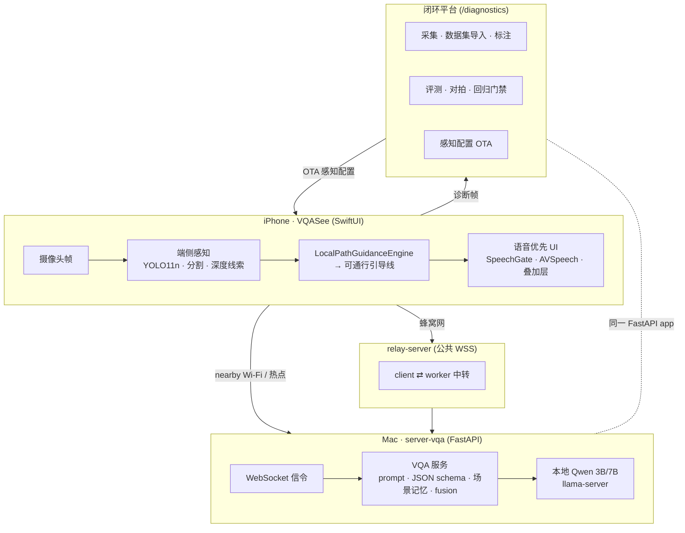
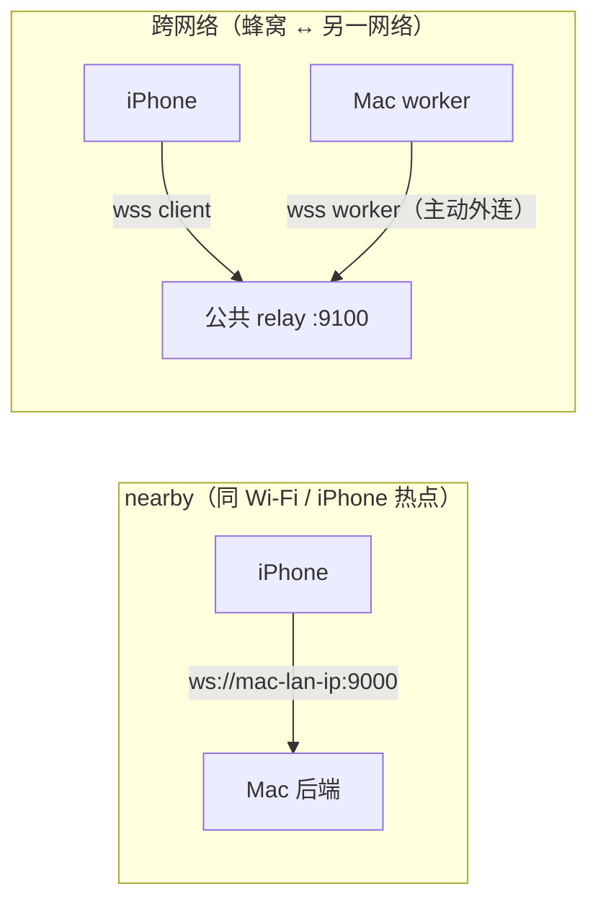
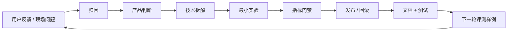
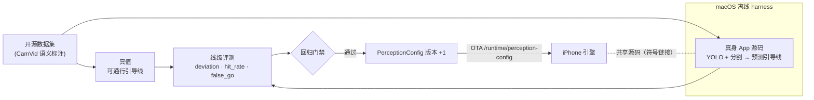

<!-- Language switch -->
[English](README.en.md) · **简体中文**

# VQASee — 面向 iPhone 的视觉优先风险与通行路径辅助

> 拿起手机就能*看见*周围的通行路径、障碍、边界和风险——语音用于确认，而不是
> 替代你自己的观察。

VQASee 是一款面向 iPhone 的视觉优先风险辅助与通行路径提示应用。它服务行走、
骑行、驾驶、通勤、看路、读标志或注意力可能分散、需要额外视觉提醒的人。目标是
做到**能用、好用、实用、可信**——提醒风险、边界和不确定性，但绝不承诺"可以走"，
也绝不替代用户自己的判断。

本仓库不只是 App：它还包含一个**闭环进化平台**，把真实使用、模型评测、延迟数据和
代码验证，转化为产品的下一轮迭代。

---

## 目录

- [仓库包含什么](#仓库包含什么)
- [系统架构](#系统架构)
- [两条运行链路（nearby 与 relay）](#两条运行链路nearby-与-relay)
- [闭环进化平台](#闭环进化平台)
- [可通行引导线](#可通行引导线)
- [端侧实时体验](#端侧实时体验)
- [目录结构](#目录结构)
- [快速开始](#快速开始)
- [本地 Qwen 运行时](#本地-qwen-运行时)
- [测试](#测试)
- [知识库](#知识库)
- [原则](#原则)

---

## 仓库包含什么

| 层 | 作用 | 位置 |
|---|---|---|
| **iOS App** | SwiftUI 摄像头应用、语音优先 UI、端侧感知（YOLO11n + 分割 + 深度线索）、引导线、模式栏 | `ios-vqa-app/VQASee` |
| **VQA 后端** | FastAPI 服务：WebSocket 信令、prompt/schema、场景记忆、经 `llama-server` 的 Qwen 3B/7B、fusion 兜底 | `server-vqa/app` |
| **闭环平台** | 诊断采集、数据集导入、标注、评测、对拍、回归门禁、感知配置 OTA | `server-vqa/app/diagnostic_*` |
| **离线 harness** | macOS SwiftPM CLI，用**真身** App 感知源码跑基准数据集 | `ios-vqa-app/perception-harness` |
| **Relay** | 公共 WSS relay，让走蜂窝网的 iPhone 也能连到 Wi-Fi 上的 Mac worker | `relay-server` |
| **iOS 自动化** | 构建 / 测试 / 归档 / TestFlight 脚本 | `deploy/ios` |

当前产品能力：nearby 自动发现、跨网络 relay、四种模式（`周围` / `行走` /
`读文字` / `详细`）、语音优先交互与按住说话提问、场景记忆与变化播报、端侧 OCR，
以及输出**可通行引导线**、由闭环平台验证的端侧感知层。

## 系统架构



## 两条运行链路（nearby 与 relay）

iPhone 连到推理的两种方式，**都不需要路由器端口转发**。



- **nearby**：Bonjour `_vqasee._tcp` 自动发现（优先数字 IPv4），自动填地址；仍需
  你点 **开始视觉辅助**——摄像头绝不自动推流。切换网络（热点 ↔ Wi-Fi）会清掉过期
  IP 并重新发现，而不是钉死在失效地址。
- **relay**：两端都主动外连到带同一配对 token 的公共 relay，于是 4G/5G 上的手机
  也能连到 Wi-Fi 上的 Mac。

<details>
<summary>Relay MVP 限制与配置</summary>

- 单帧 Base64 上限 `900000` · 每客户端每分钟 `30` 帧 · 每客户端在途 `1` 个
- iOS 默认帧间隔 `2s`；帧质量随模式：
  行走 448px/120KB · 周围 640px/220KB · 详细 768px/320KB · 读文字 1024px/520KB

```bash
# 1) 公共主机（或本地测试）
export RELAY_PAIRING_TOKEN="$(python3 -c 'import secrets; print(secrets.token_urlsafe(32))')"
bash ./start_relay.sh
# 2) 跑推理的 Mac worker
export RELAY_WORKER_URL=ws://<relay-host>:9100/ws/worker
export RELAY_PAIRING_TOKEN=<同一 token>
export WORKER_ID=local-mac-worker
bash ./start_worker.sh
# 3) iOS App：Server URL 填 ws(s)://<relay-host>:9100/ws/client，同 token + worker id
```
</details>

## 闭环进化平台

每个功能都必须**形成闭环**，而不是"做完一个页面"。平台把这个闭环变得具体、可检查，
入口在 `http://127.0.0.1:9000/diagnostics/ui`。



感知子闭环让平台能在开源数据集上测试 iPhone 的**端侧**感知（YOLO + 分割 +
引导引擎），并把调好的配置推回设备——且**不需要**完整 Xcode：



- 可调 ROI + 阈值的**单一真源**：`server-vqa/app/perception_config.py`（Python），
  由 `PerceptionConfig.swift` 镜像，契约测试防漂移。
- **诚实能力探针**：predictor 会以原因上报 `unsupported`，而不是静默失败
  （例如缺 `onnxruntime`）。
- **回归门禁**：安全关键指标（如 `risk_miss`、`false_go`）相对基线不得变差，
  否则拦截候选。

## 可通行引导线

感知引擎输出**一条或多条可通行引导线**（带走廊半宽、置信度和风险段的折线），
而不是框。当自由空间破碎到无法成线时，显式降级为 `insufficient`，**绝不伪造**
一条直线。

```text
 图像帧（底边 = 你的脚下）
 ┌─────────────────────────────────────┐
 │                 · · · 地平线          │
 │                 ╱                    │
 │                ╱   ← 预测引导线       │
 │              ┆╱┆      （含走廊）      │
 │              ┆ ┆                     │
 │             ╱   ╲   ← 真值线          │
 │            ●  你                     │
 └─────────────────────────────────────┘
   紫色实线 = 设备预测（含走廊带）
   绿色虚线 = 真值可通行引导线（来自语义 mask）
```

预测线与真值线共用同一 schema（`app/guidance_path.py` ↔ `GuidancePath.swift`），
闭环才能公平打分。逐帧叠加对照见
`/diagnostics/datasets/ios-harness/frames/ui`。

## 端侧实时体验

用户真正看到的画面——安静的状态栏、叠在实时相机上的引导线、附近风险的提示条，
以及一句简短语音。语音只做确认，绝不承诺"可以走"。

```text
        ┌─────────────────────────────┐
        │  ● 已连接    行走模式   ⏱1.2s │   ← 状态：连接 · 模式 · 延迟
        │                             │
        │         (实时相机)           │
        │             ╱               │
        │            ╱  ← 引导线        │
        │          ┆╱┆     +走廊        │
        │          ┆ ┆                 │
        │         ╱   ╲               │
        │   ⚠ 右前 行人                │   ← 风险提示条（附近危险）
        │        ●  你                 │
        │                             │
        │  “前方可走，注意右前行人”      │   ← spoken_text / 摘要
        │        [  按住说话  ]         │   ← 按住说话提问
        └─────────────────────────────┘
```

- **状态明确**：发现中 / 已连接 / 推流中 / 处理中 / 超时 / 已断开 / 重连中——
  绝不静默卡住。
- **语音门控，但帧不丢**：每帧都会刷新屏幕；`SpeechGate` 只决定要不要*出声*，
  所以画面永不发呆，同时避免重复播报。
- **按住说话**：单轮提问，随下一帧作答。

## 目录结构

```text
onepiece/
├── ios-vqa-app/
│   ├── VQASee/VQASee/            # SwiftUI App + 端侧感知
│   │   ├── LocalPerception.swift LocalSegmentation.swift LocalVisionAnalyzer.swift
│   │   ├── GuidancePath.swift    PerceptionConfig.swift   CameraCapture.swift
│   │   └── StreamingViewModel.swift SettingsView.swift ...
│   └── perception-harness/       # 用真身 App 源码的 macOS SwiftPM CLI
├── server-vqa/
│   ├── app/                      # FastAPI 后端 + 闭环平台
│   │   ├── main.py signaling.py vqa_service.py prompts.py scene_context.py
│   │   ├── diagnostic_api.py diagnostic_capture.py     # 平台 UI/API
│   │   ├── perception_config.py guidance_path.py guidance_path_eval.py
│   │   ├── open_dataset_adapters.py path_* traversability_predictor.py
│   │   └── eval_baseline.py regression_gate.py
│   ├── tools/                    # run_ios_harness_eval.py, ...
│   └── tests/
├── relay-server/                 # 公共 WSS relay MVP
├── deploy/ios/                   # 构建 / 测试 / 归档 / TestFlight
├── docs/                         # decisions · evolution · model-lab · ui-lab · ...
├── AGENTS.md                     # 团队角色与工作协议
└── start_*.sh                    # backend / diagnostics / qwen / relay / worker
```

## 快速开始

```bash
# 0) 一次性创建虚拟环境
python3 -m venv .venv && source .venv/bin/activate
pip install -r server-vqa/requirements-dev.txt

# 1) 后端（推理/信令）
bash ./start_backend.sh                       # ws://localhost:9000/ws/signaling
# 或：HOST=127.0.0.1 PORT=9000 bash ./start_backend.sh

# 2) 只启动闭环平台（不做 Qwen 预热）
bash ./start_diagnostics_platform.sh          # 自动打开 /diagnostics/ui

# 3) 完整本地栈（后端 + 本地 Qwen）
bash ./start_local_vqa.sh

# 4) 离线感知 harness（macOS）
cd ios-vqa-app/perception-harness && swift build
./.build/debug/PerceptionHarness \
  --manifest ../../docs/datasets/camvid-manifest.jsonl \
  --model-dir ../VQASee/VQASee --out /tmp/camvid-ios-harness.jsonl
```

<details>
<summary>iOS 构建与发布</summary>

1. 在 `ios-vqa-app/VQASee` 用 Xcode 创建 `VQASee.xcodeproj`（签名/team/bundle id；
   相机/定位/本地网络权限；安装 iOS 平台运行时）。
2. `cp deploy/ios/ExportOptions.plist.template deploy/ios/ExportOptions.plist`
3. 自动化：
   ```bash
   bash deploy/ios/preflight.sh
   bash deploy/ios/build.sh                 # 设备/发布
   SDK=iphonesimulator CONFIGURATION=Debug bash deploy/ios/build.sh
   bash deploy/ios/test.sh
   bash deploy/ios/install_on_device.sh     # DEVICE_ID=<udid> 指定设备
   bash deploy/ios/archive.sh
   bash deploy/ios/release_testflight.sh
   ```
</details>

## 本地 Qwen 运行时

`start_qwen_local.sh` **直接启动 `llama-server`**（`Ollama.app` 内置的二进制），
而不是让 Ollama 托管——因为 Ollama 把 `qwen2.5vl` 的 `--image-min-tokens` 锁死在
**1024**，这主导了 prefill 成本。自己跑 server 就能传 `--image-min-tokens 256`。

同一张 448px 帧上实测（M4 Air, 16GB）：

| `image-min-tokens` | prompt tokens | **prefill** | decode |
|---|---|---|---|
| 1024（Ollama 默认） | 1048 | **~5.0 s** | ~1.4 s |
| 256（本运行时） | 280 | **~1.3 s** | ~1.2 s |

```bash
bash ./start_qwen_local.sh                    # http://127.0.0.1:11435 (start|stop|status|supervise)
QWEN_API_BASE_URL=http://127.0.0.1:11435 QWEN_MODEL=qwen2.5vl:3b bash ./start_backend.sh
MODEL=qwen2.5vl:7b bash ./start_qwen_local.sh # 选 7B 前先在 Mac 上拉一次
```

<details>
<summary>运行时参数与诚实的延迟预期</summary>

- 环境变量：`LLAMA_PORT` (11435) · `IMAGE_MIN_TOKENS` (256) · `IMAGE_MAX_TOKENS`
  (512) · `LLAMA_SERVER_BIN` · `OLLAMA_MODELS_DIR` · `MODEL` (`qwen2.5vl:3b`)。
- `USE_OLLAMA=1` 回退到 Ollama 托管（锁死 1024，API `:11434`）。
- `supervise` 在崩溃时重启 `llama-server` 并记录每次重启（不静默失败）。
- decode 长度：快速安全 schema `QWEN_MAX_TOKENS_FAST`（260）；完整描述
  `QWEN_MAX_TOKENS_FULL`（520）。
- 连续帧默认只带当前图 + 文本场景上下文；
  `QWEN_SEND_PREVIOUS_IMAGE_IN_INCREMENTAL=1` 才启用双图对比。

> 单张 3B 帧在 16GB Mac 上约 2.5 s（prefill ~1.3 s + decode ~1.2 s）——完整帧推理
> **达不到** 1s。亚秒级的*体感*来自场景记忆门控：静止帧既不重复推理也不重复播报。
</details>

## 测试

```bash
source .venv/bin/activate
pytest server-vqa/tests            # 后端 + 闭环平台
pytest relay-server/tests          # relay
cd ios-vqa-app/perception-harness && swift build   # 编译真身 App 感知源码
bash deploy/ios/test.sh            # iOS（需完整 Xcode）
```

测试底线（见 `AGENTS.md`）：mock 要接近真实输入/错误/schema；断言必须覆盖安全、
失败恢复、超时、不确定性和用户可见状态；绝不为掩盖 bug 删测试。

## 知识库

产品在 `docs/` 下自我沉淀：

- `docs/decisions/` — 产品/架构决策记录
- `docs/evolution/` — 迭代/闭环记录
- `docs/model-lab/` — 模型与评测经验（如 CamVid 调色板修正、引导线基线）
- `docs/ui-lab/` — UI 打磨经验
- `docs/performance/` — 延迟与系统经验
- `docs/tech-radar/` — 外部 SOTA 技术情报
- `docs/roadmap.md` — 北极星与阶段

## 原则

1. **安全第一** — 不隐藏、不静默丢弃影响安全的视觉变化。
2. **视觉引导优先，语音辅助确认** — 用户应能*看见*路径、障碍和风险；语音用于补充
   和免手操作。
3. **延迟就是体验** — 编码 / 网络 / 模型耗时都是产品指标。
4. **不允许静默失败** — 失败要在 UI、语音、日志或测试中可见，并有清晰恢复路径。
5. **默认保护隐私** — 尽量少持久化图片/音频；任何远程路径都要说明。
6. **辅助而非接管** — VQASee 提醒风险、边界和不确定性；绝不承诺"可以走"，也绝不
   替代用户在行走、骑行、驾驶时的主动观察。

---

<sub>团队角色、工作协议和 skill 调度见 [`AGENTS.md`](AGENTS.md)。</sub>
