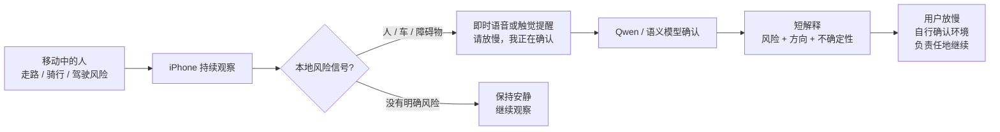

# 01 — 产品体验流程：VQASee 是视觉风险辅助

受众：产品评审、用户、非工程人员。

## 一句话说明

VQASee 用 iPhone 摄像头持续观察环境；发现本地风险时先给即时提醒；需要更深理解时，再由语义模型解释画面。

## 面向用户的流程

## 这张图要传达什么

- VQASee 不是聊天机器人。
- VQASee 不是自动驾驶系统。
- VQASee 是视觉风险辅助：**先快速提醒，再解释原因**。

## 当前能力与未来能力

| 能力 | 当前状态 | 下一步 |
|---|---|---|
| 人 / 车 / 自行车 / 常见物体 | YOLO11nObject + Apple Vision | 用真实诊断数据继续提升 |
| 道路边界 | UI 通道已有，但不可靠 | RoadBoundary 原型验证 |
| 台阶 / 坑洞 / 落差 | 还不可靠 | LiDAR / Depth Anything |
| 语音提醒 | 本地即时提醒 + Qwen 结果提醒 | 更好的时机控制和状态机 |
