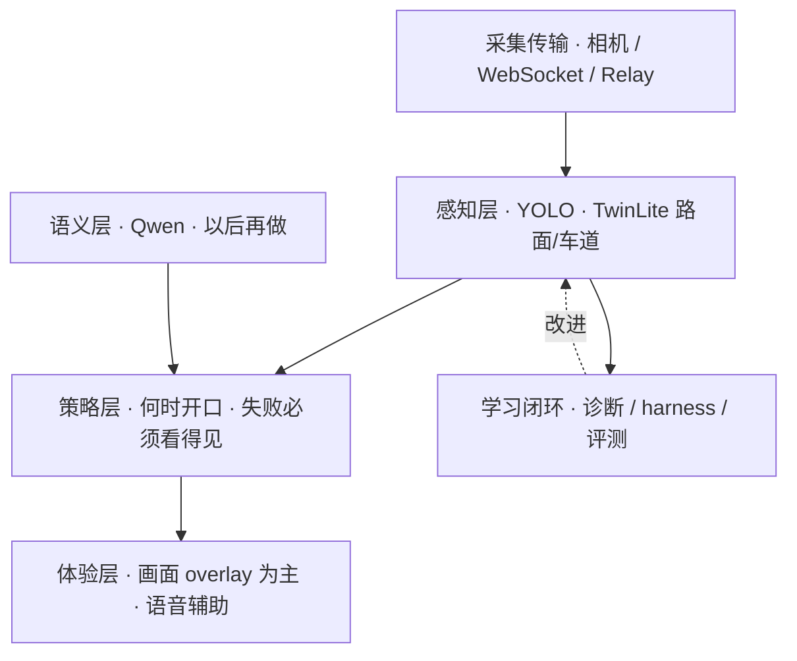

# 02 — 分层架构

受众：工程、产品。现行规定见 [`docs/CURRENT.md`](../../CURRENT.md)。

| 层级 | 代码 |
|---|---|
| 采集 | `CameraCapture.swift` |
| 路面 | `RoadSurface.swift` · TwinLite 默认 |
| 障碍 | `LocalPerception.swift` · YOLO11n |
| Overlay | `CameraRiskOverlay.swift` |
| 诊断 | harness + `server-vqa/app/diagnostic_*` |
