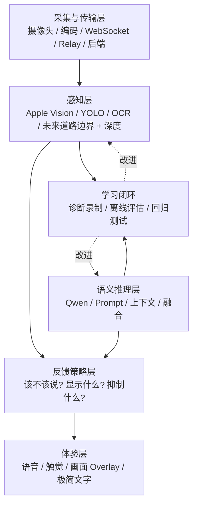

# 02 — 分层架构

受众：工程、产品、设计。

## 分层模型

## 为什么不能只靠一个大模型

- 本地感知快，但会误检/漏检。
- Qwen 表达能力强，但慢。
- UI 和语音不能在有明显风险时等待慢模型。
- 诊断闭环让系统从真实失败中学习。

## 当前实现对应代码

| 层级 | 代码位置 |
|---|---|
| 采集 | `CameraCapture.swift`, `FrameJPEGEncoder` |
| 本地感知 | `LocalVisionAnalyzer.swift`, `LocalPerception.swift` |
| 画面 Overlay | `CameraRiskOverlay.swift` |
| 语音策略 | `PureHelpers.swift`, `StreamingViewModel.swift` |
| 后端 VQA | `server-vqa/app/vqa_service.py` |
| 诊断闭环 | `DiagnosticCaptureRecorder.swift`, `server-vqa/tools/analyze_diagnostic_capture.py` |
