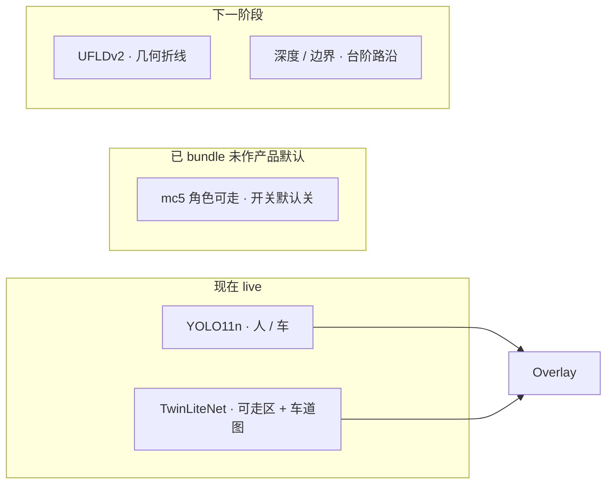

# 03 — 模型职责地图

受众：模型工程、产品。现行规定见 [`docs/CURRENT.md`](../../CURRENT.md)。

| 能力 | 现在谁负责 | 不要误会 |
|---|---|---|
| 人 / 车 | YOLO11n | 不是台阶 / 路沿 |
| 路面 + 车道图 | TwinLite | 不分人行道 vs 马路 |
| 角色可走 | mc5 代码在，live 关 | 承诺未兑现 |
| 几何车道线 | UFLDv2 未上 live | CamVid 像素不是产品线 |
| 解释 / 问答 | Qwen | 以后再做，不是主路径 |
