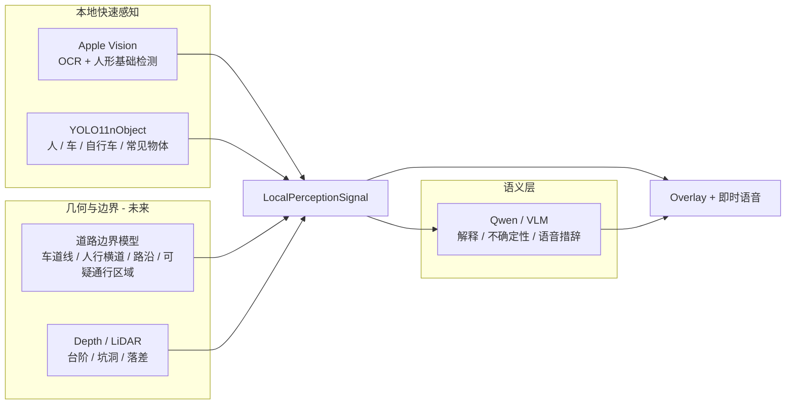

# 03 — 模型职责地图

受众：模型工程、产品评审。

## 原则

没有一个模型能负责整个世界。每个模型只负责自己擅长的部分。

## 职责表

| 能力 | 当前负责人 | 下一步负责人 |
|---|---|---|
| OCR 读文字 | Apple Vision | Apple Vision + Qwen 确认 |
| 人形检测 | Apple Vision | Apple Vision + YOLO |
| 车辆 / 自行车 / 常见物体 | YOLO11nObject | 更好的检测器 + 真实诊断数据 |
| 车道线 / 人行横道 / 路沿 | 只有 schema 和 UI 通道 | YOLOPv2 / HybridNets / 语义分割 |
| 台阶 / 坑洞 / 落差 | 只有 schema 和 UI 通道 | LiDAR / Depth Anything / 深度规则 |
| 解释与总结 | Qwen | Qwen + 结构化本地感知信号 |

## 诚实边界

当前 UI 可以显示道路和深度线索，但前提是有模型输出这些线索。  
这不代表 VQASee 已经能稳定识别车道线、人行横道、路沿、台阶或坑洞。
