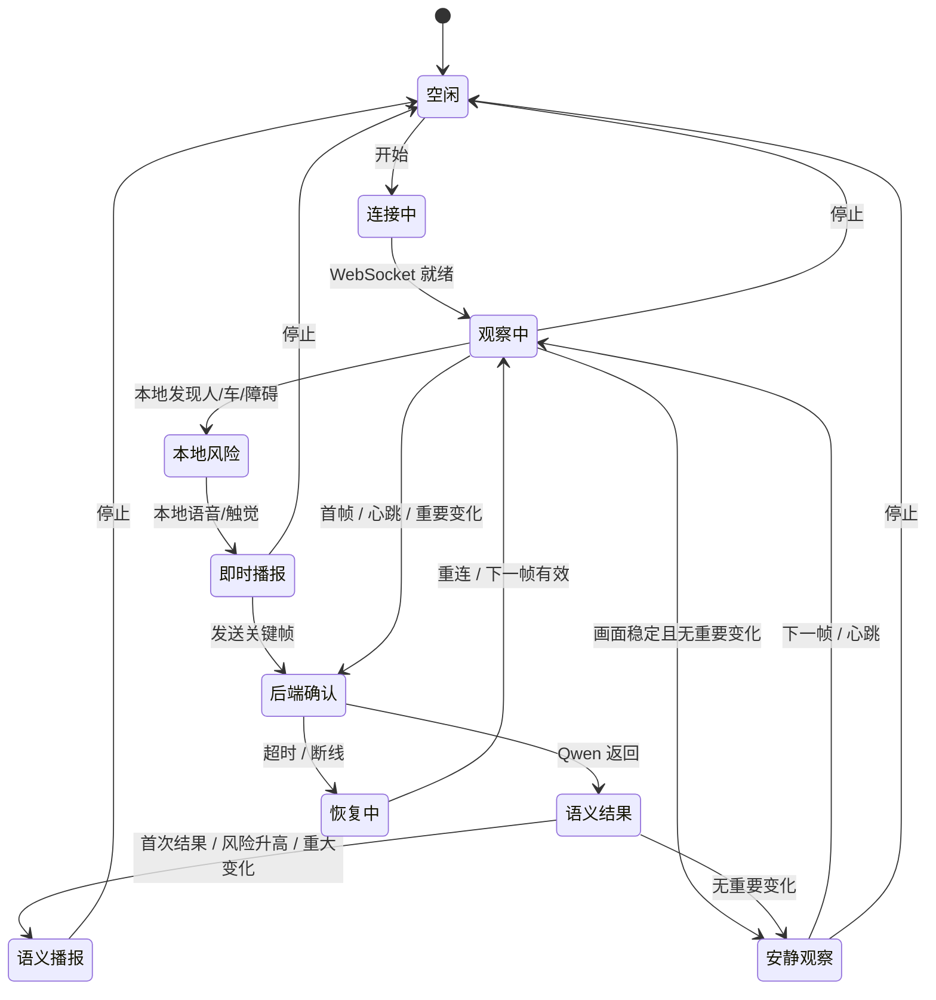

# 04 — 走路模式状态机

受众：产品、iOS、后端。

## 状态机



## 关键行为

- 本地风险可以先播，不等 Qwen。
- 稳定帧可以跳过后端，但 Overlay 继续更新。
- Qwen 可能慢，它负责解释，不应该成为第一安全信号。
- 当前限制：切换模式时，正在飞行的旧请求还没有 generation 级取消。

## 必须补的下一步

增加：

```text
modeGeneration / frameGeneration
```

目标：切换模式后，旧结果不能覆盖新模式 UI。
