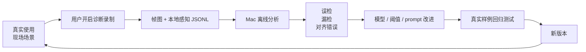

# 05 — 诊断学习闭环

受众：所有人。这是提升准确率的核心。

## 为什么需要它

真实截图已经证明：YOLO 会把室内水桶/门边误检成车辆。  
这不是 UI 能解决的问题，也不能靠一句 prompt 解决。VQASee 必须形成真实数据闭环。



## 诊断包格式

```text
VQASeeDiagnostics/session-.../
  metadata.json
  manifest.jsonl
  frame-0001.jpg
  frame-0002.jpg
```

## 分析命令

```bash
python server-vqa/tools/analyze_diagnostic_capture.py /path/to/session
```

可选：离线重跑 Qwen。

```bash
QWEN_API_BASE_URL=http://127.0.0.1:11435 \
QWEN_MODEL=qwen2.5vl:3b \
python server-vqa/tools/analyze_diagnostic_capture.py /path/to/session --run-qwen --limit 20
```

## 闭环产出

- 真实误检样例；
- 真实漏检样例；
- 模型阈值；
- overlay 坐标对齐修复；
- 未来微调数据；
- 不能被假 mock 糊弄的回归测试。
