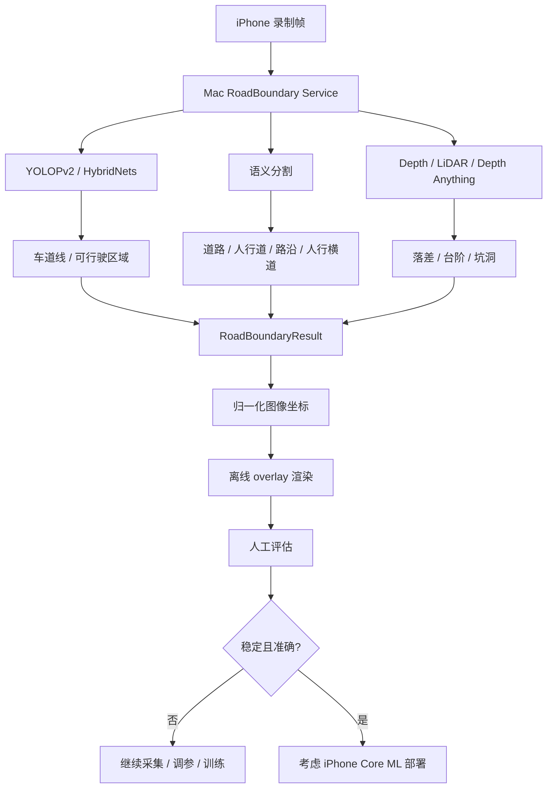

# 06 — 道路边界原型

受众：模型、后端、产品。

## 目标

准确识别道路边界、车道线、人行横道、路沿/人行道边界，并把候选通行/行驶走廊贴合到视频画面上。

## 原型流程



## 输出合同草案

```json
{
  "coordinate_space": "normalized_image",
  "road_boundary": {
    "left_polyline": [[0.12, 0.88], [0.32, 0.38]],
    "right_polyline": [[0.88, 0.88], [0.68, 0.38]],
    "confidence": 0.72
  },
  "crosswalk": {
    "polygons": [],
    "confidence": 0.61
  },
  "guidance_corridor": {
    "centerline": [[0.5, 0.9], [0.5, 0.4]],
    "status": "caution"
  }
}
```

## 产品边界

在满足以下条件前，不能把它作为“路线”上线：

- 视频坐标对齐已验证；
- 时序稳定性可接受；
- 误报/漏报率有记录；
- 语言始终谨慎：**疑似、请放慢、请自行确认**。
