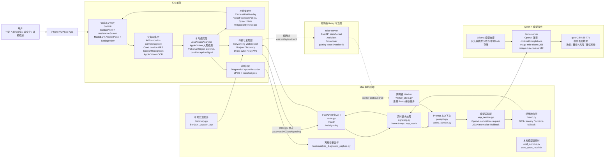
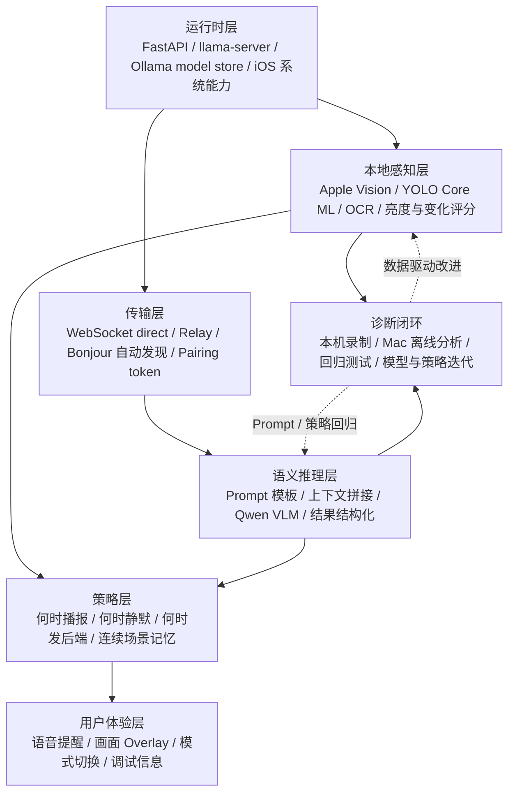
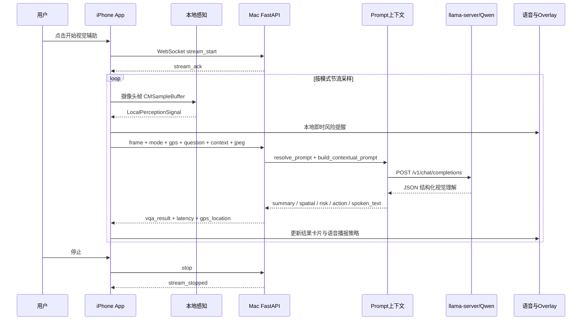
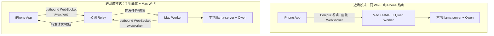

# VQASee 研发架构图

Date: 2026-08-07

面向受众：iOS、后端、模型服务、测试与部署研发人员。

## 1. 总体架构图

## 2. 分层职责

## 3. 实时推理时序

## 4. 两种联网拓扑

### 拓扑选择

- **近场模式**：适合现场演示、研发联调。iPhone 与 Mac 在同一网络时，App 可以通过 Bonjour 自动发现 Mac 后端，不需要手输 IP。
- **跨网络模式**：适合 iPhone 走蜂窝、Mac 在公司 Wi-Fi 的情况。iPhone 和 Mac 都主动连公网 Relay，避免路由器端口转发和内网穿透依赖。
- **模型仍在 Mac**：当前 Qwen 3B/7B 由 Mac 本地 `llama-server` 承载，不随 App 安装到 iPhone。

## 5. 核心模块与代码位置

| 模块 | 主要职责 | 代码位置 |
|---|---|---|
| iOS 主界面 | 模式、结果卡片、设置入口、用户交互 | `ios-vqa-app/VQASee/VQASee/ContentView.swift`, `AssistanceScreen.swift`, `AnswerPanel.swift`, `ModeBar.swift`, `SettingsView.swift` |
| 摄像头采集 | 相机预览、帧采样、JPEG 编码 | `CameraCapture.swift`, `StreamingViewModel.swift` |
| 本地感知 | Apple Vision、YOLO Core ML、OCR、本地风险信号 | `LocalVisionAnalyzer.swift`, `LocalPerception.swift`, `OCRRecognition.swift` |
| 语音反馈 | 本地即时播报、Qwen 结果播报、重复抑制 | `PureHelpers.swift`, `PressToTalkButton.swift`, `SpeechRecognitionController.swift` |
| 传输发现 | WebSocket、Bonjour 自动发现、服务器选择 | `Networking.swift`, `BonjourDiscovery.swift`, `ServerPickerView.swift` |
| 后端入口 | FastAPI HTTP/WS、健康检查、信令入口 | `server-vqa/app/main.py`, `server-vqa/app/signaling.py` |
| Prompt 构建 | 模式化 prompt、连续场景上下文、问答上下文 | `server-vqa/app/prompts.py`, `server-vqa/app/scene_context.py` |
| VQA 调用 | OpenAI 兼容接口、Qwen 响应解析、fallback | `server-vqa/app/vqa_service.py`, `server-vqa/app/fusion.py` |
| 本地模型运行时 | 启动 llama-server、加载 Qwen 模型、调优视觉 token | `server-vqa/app/local_runtime.py`, `start_qwen_local.sh`, `start_local_vqa.sh` |
| Relay | 跨网络 client/worker 转发、限流、配对 token | `relay-server/relay_app/main.py`, `start_relay.sh`, `start_worker.sh` |
| 诊断闭环 | 本机诊断录制、Mac 离线分析 | `DiagnosticCaptureRecorder.swift`, `server-vqa/tools/analyze_diagnostic_capture.py` |

## 6. 当前研发重点

1. **低延迟体验**：本地风险先提示，Qwen 慢结果后解释；通过 frame gating、scene memory、speech suppression 减少重复推理和重复播报。
2. **结构化输出**：后端要求 Qwen 返回 `summary / spatial_description / risk_level / suggested_action / spoken_text` 等字段，`fusion.py` 只做兜底与融合。
3. **跨网络可用性**：近场用 Bonjour 自动发现；不同网段用 Relay。研发调试时要明确当前走的是 direct 还是 relay。
4. **安全边界**：VQASee 是视觉风险辅助，不输出“可以走/可以开/安全”等替代用户判断的结论。
5. **诊断驱动迭代**：真实误检、漏检、延迟异常应通过诊断录制进入离线分析与回归测试，而不是只调 prompt。
