# 感知配置闭环数据流（harness + OTA）

日期：2026-08-18

一份版本化 `PerceptionConfig` 是枢纽：macOS 离线 harness（测 iPhone 真身）与 OTA（更新 iPhone）共用同一 schema 与默认值。

```mermaid
flowchart LR
  subgraph src[单一真源]
    pyCfg["server-vqa/app/perception_config.py\n(version + roi + thresholds + 校验)"]
    swCfg["PerceptionConfig.swift\n(.default + Wire Codable + 镜像校验)"]
  end

  data["CamVid 等 GT 数据集\n(docs/datasets/*.jsonl)"]

  subgraph mac[macOS 离线 harness = iPhone 真身]
    hb["PerceptionHarness (SwiftPM CLI)\n符号链接复用 App 感知源码\nYOLO11n + 分割 + LocalPathGuidanceEngine"]
  end

  data --> hb
  swCfg -. "--config" .-> hb
  hb -->|"prediction JSONL\nprediction_source=ios_coreml_offline_harness"| evaltool

  subgraph plat[平台/后端]
    evaltool["run_ios_harness_eval.py\nevaluate + parity + gate"]
    editor["诊断台 感知配置编辑器\n/diagnostics/perception-config/*"]
    store["config 存储\n(server-vqa/data/perception_config.json)"]
    ota["GET /runtime/perception-config"]
  end

  evaltool -->|"门禁通过→调参"| editor
  editor -->|"bump version, 校验"| store
  store --> ota

  subgraph ios[iPhone App]
    vm["StreamingViewModel.refreshPerceptionConfig()\n连接后拉取→校验→应用/回退可见"]
    eng["LocalVisionAnalyzer / LocalPathGuidanceEngine"]
  end

  ota -->|"连接后拉取"| vm
  vm -->|"apply(config) / 失败回退 .default"| eng
  pyCfg <-. "逐字段对齐(防漂移测试)" .-> swCfg
```

## 关键契约

- **默认即当前常量**：`PerceptionConfig.default` 的 ROI 复用 `LocalPathGuidanceEngine` 常量；采纳 config 前行为完全不变。
- **校验不静默**：越界/ROI 越框/未知键 → Python `ConfigValidationError` / Swift `PerceptionConfigError`，后端 400、harness rc=1、iOS 回退默认并在设置页显示（橙色）。
- **门禁**：`--gate` 用 `regression_gate.check_regression`，`risk_miss` 变差则 rc=4，禁止 bump/下发。
- **OTA 边界**：只下发数值配置，不下发代码/模型。
- **保真边界**：harness 无 LiDAR 深度（仅相机分支），见 [model-lab 卡](../model-lab/2026-08-18-ios-offline-harness-fidelity.md)。

## 相关文件

- 后端：`server-vqa/app/perception_config.py`、`server-vqa/app/main.py`（`/runtime/perception-config`）、`server-vqa/app/diagnostic_api.py`（编辑器 + iPhone 真身评估向导）、`server-vqa/tools/run_ios_harness_eval.py`
- iOS/harness：`ios-vqa-app/VQASee/VQASee/PerceptionConfig.swift`、`LocalPerception.swift`、`LocalVisionAnalyzer.swift`、`LocalSegmentation.swift`、`StreamingViewModel.swift`、`SettingsView.swift`、`ios-vqa-app/perception-harness/`
