# VQASee 架构图与场景流程图

Date: 2026-08-07

> 产品定位：VQASee 是语音优先的视觉风险辅助系统，服务行人、骑行者、驾驶者、低视力用户和注意力可能分散的人。它提醒风险、边界、物体和不确定性；不承诺“可以走/可以开”，不替代用户观察或驾驶责任。

## 1. 总体系统架构

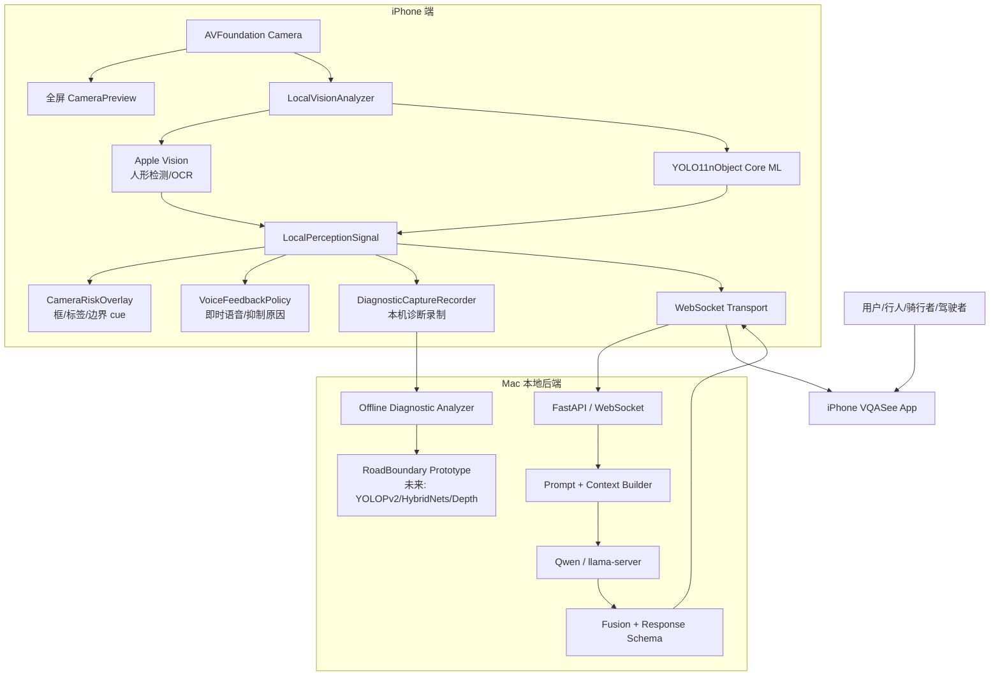

### 当前已经实现

- iPhone 摄像头取帧；
- Apple Vision 人形检测和 OCR；
- `YOLO11nObject.mlmodelc` 本地 Core ML 目标检测；
- `LocalPerceptionSignal` 统一本地感知输出；
- `CameraRiskOverlay` 显示检测框、标签、疑似道路 cue；
- `VoiceFeedbackPolicy` 和 `WalkingImmediateFeedbackPolicy`；
- WebSocket 到 Mac 后端；
- Qwen 本地 VQA；
- 诊断录制和 Mac 离线分析脚本。

### 当前未真正解决

- 精准道路边界；
- 准确人行横道 / 车道线 / 路沿；
- 台阶 / 坑洞 / 落差可靠识别；
- 真正可行走/可行驶轨迹预测；
- overlay 与 `resizeAspectFill` 的严格几何校准。

---

## 2. iPhone 实时帧处理流程

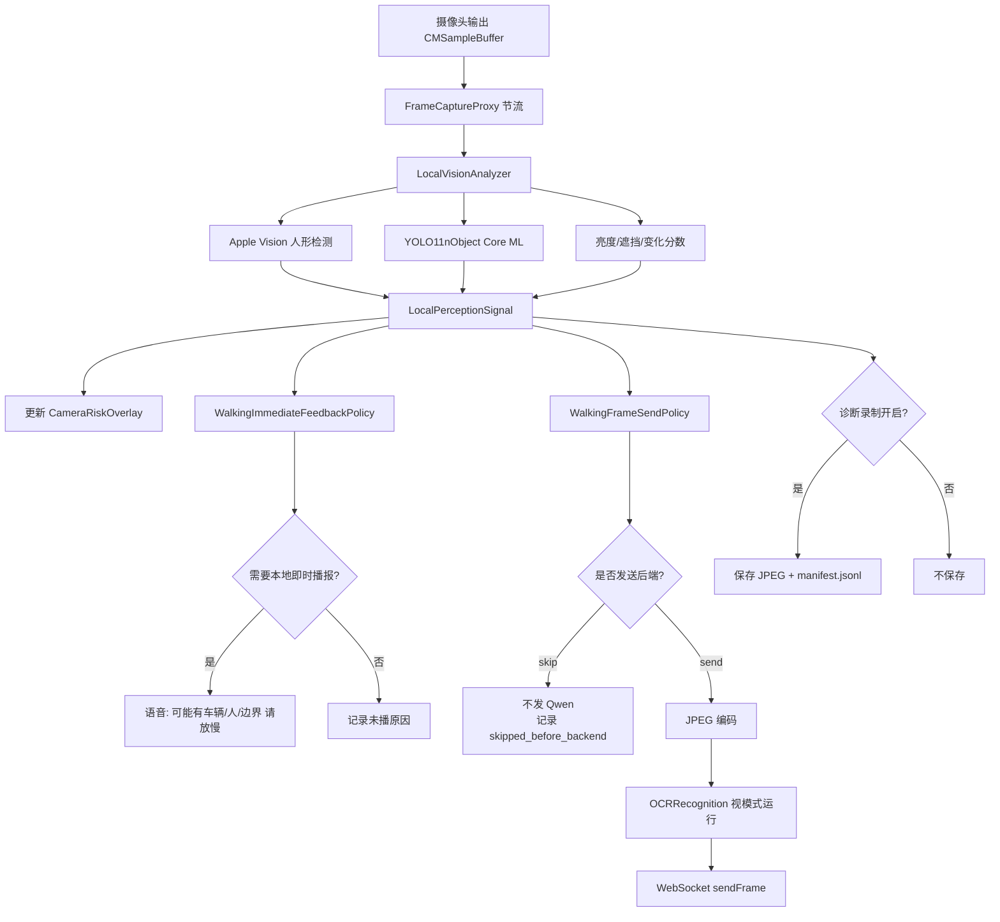

### 关键设计

- 本地感知先于 Qwen；
- 本地语音不等 Qwen；
- 后端慢时，用户仍可能先听到“可能有车/人，请放慢”；
- 诊断录制只在用户手动开启时保存到本机 Documents；
- 固定蓝色假轨迹线已下线，避免误导。

---

## 3. WebSocket / 后端 Qwen 流程

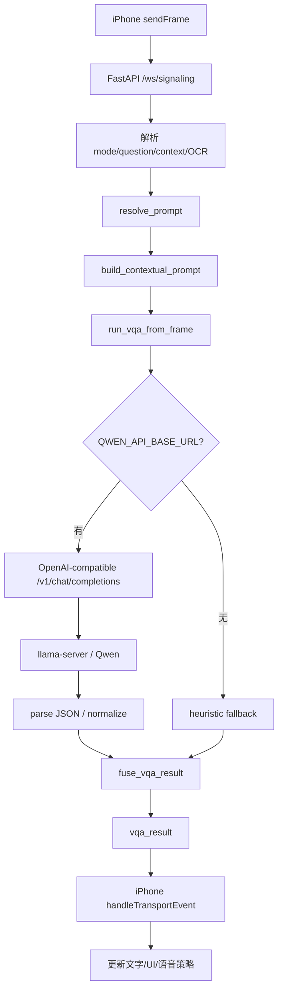

### 后端关键点

- walking / surroundings 可使用 fast response schema；
- continuous modes 默认不再发送 previous image，避免双图 prefill；
- Qwen 输出异常会显式暴露，不静默失败；
- `latency_ms` 是后端模型处理时间，iOS 端会组合端到端延迟。

---

## 4. UI Overlay 流程

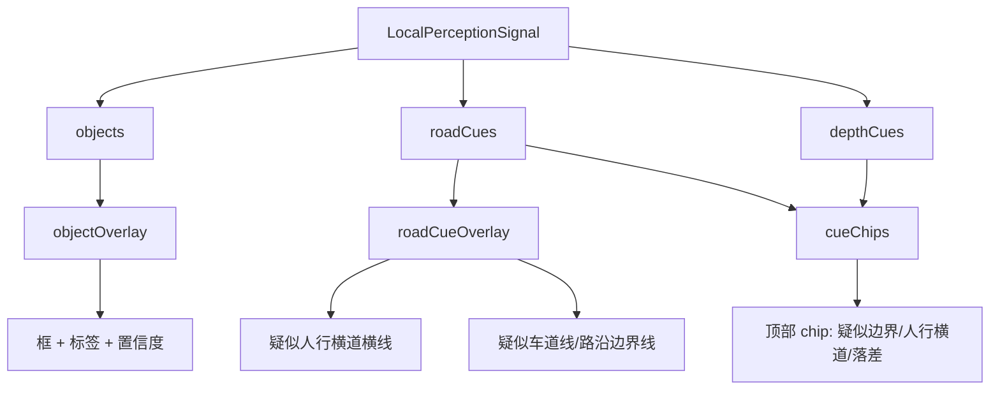

### UI 语义

| UI 元素 | 当前含义 | 是否可靠 |
|---|---|---|
| 橙色框 | YOLO 识别车辆/自行车等 | 初步可用，需真机评估 |
| 黄色框 | 人/动物 | 初步可用，需评估 |
| 红色框 | 障碍物/台阶/坑洞/路沿 | 通道已通，模型能力未验证 |
| 白色横线 | 疑似人行横道 | 通道已通，模型能力未验证 |
| 黄色边界线 | 疑似路沿/车道线 | 通道已通，模型能力未验证 |
| 蓝色固定线 | 已移除 | 之前是误导性 debug 线 |

---

## 5. 语音反馈流程

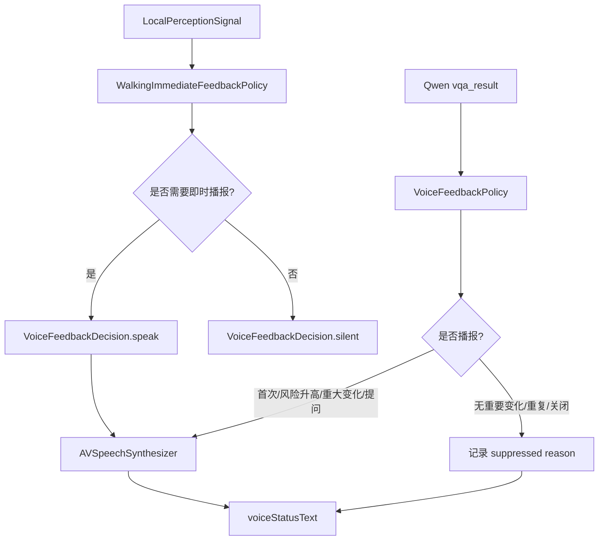

### 语音原则

- 第一条视觉结果必须播；
- 本地风险可先播，不等 Qwen；
- 重复内容会抑制；
- 设置页显示播报状态；
- 不说“可以走/可以开/前方安全”。

---

## 6. 各场景处理逻辑

### 6.1 走路模式 walking

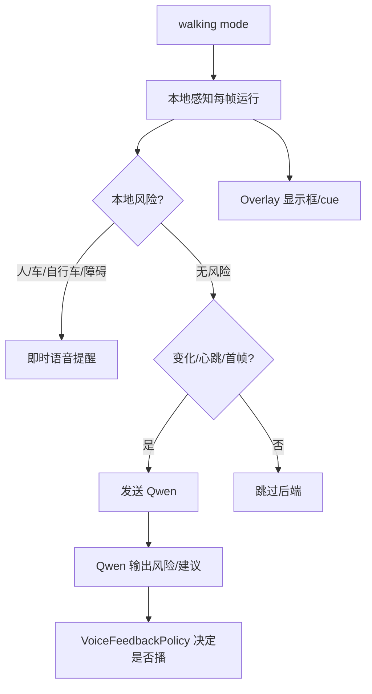

处理重点：

- 优先本地风险提醒；
- Qwen 做确认和解释；
- 不把蓝色假线当路线；
- 后续需 RoadBoundary prototype 生成真实边界/走廊。

### 6.2 看周围 surroundings

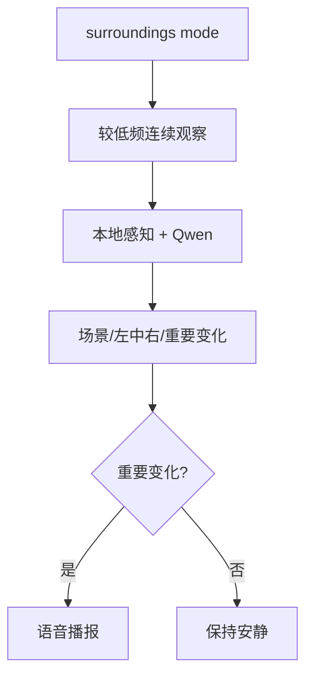

处理重点：

- 空间布局；
- 重要变化；
- 避免重复播报。

### 6.3 读文字 readText

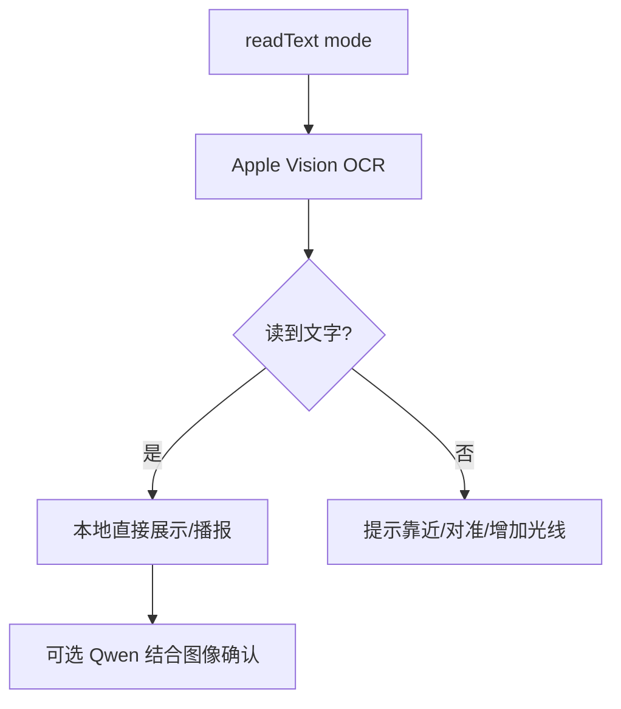

处理重点：

- OCR 优先；
- 不让 Qwen 猜“这是一张纸”；
- 文字模式可单次识别。

### 6.4 详细看 detail

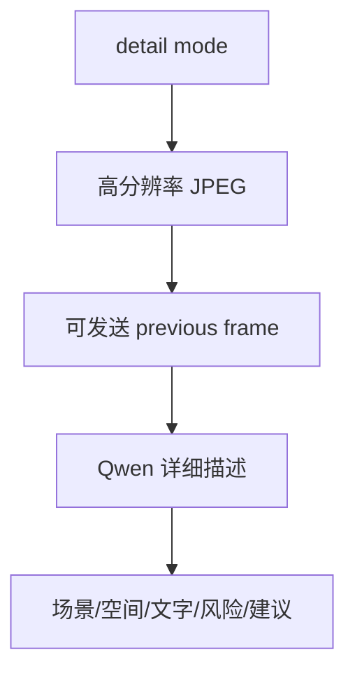

处理重点：

- 允许更慢；
- 追求完整描述；
- 不适合行走实时场景。

### 6.5 语音提问 voice question

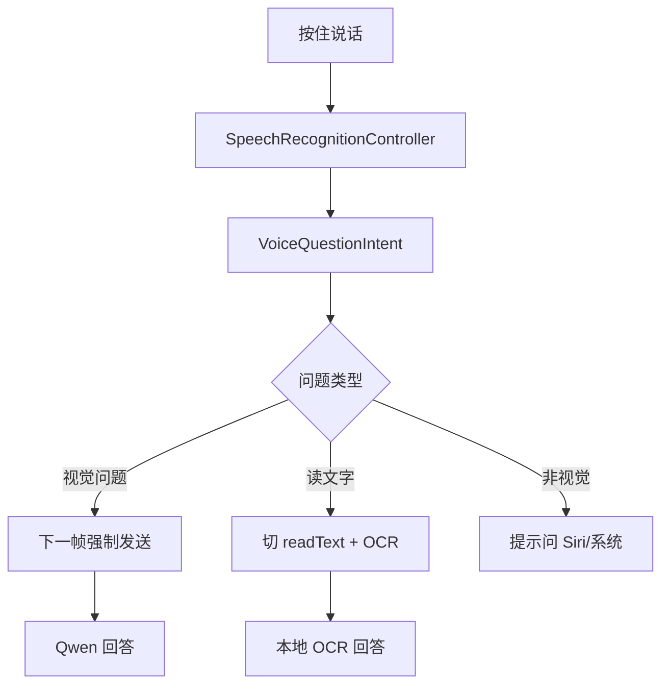

处理重点：

- 非视觉问题不进 VQA；
- 语音问题单次回答，不粘到后续每帧。

---

## 7. 诊断录制与离线分析闭环

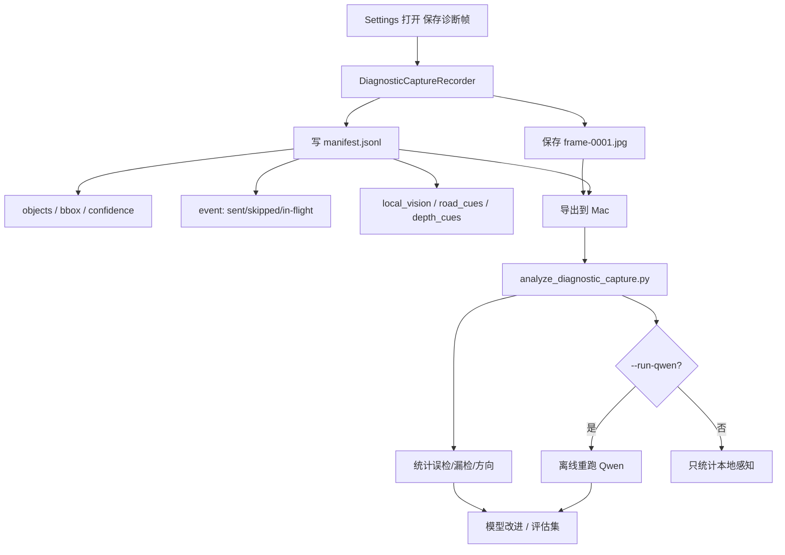

### 诊断目录格式

```text
VQASeeDiagnostics/session-.../
  metadata.json
  manifest.jsonl
  frame-0001.jpg
  frame-0002.jpg
```

Mac 分析命令：

```bash
python server-vqa/tools/analyze_diagnostic_capture.py /path/to/session
```

重跑 Qwen：

```bash
QWEN_API_BASE_URL=http://127.0.0.1:11435 \
QWEN_MODEL=qwen2.5vl:3b \
python server-vqa/tools/analyze_diagnostic_capture.py /path/to/session --run-qwen --limit 20
```

---

## 8. RoadBoundaryPerception 未来原型

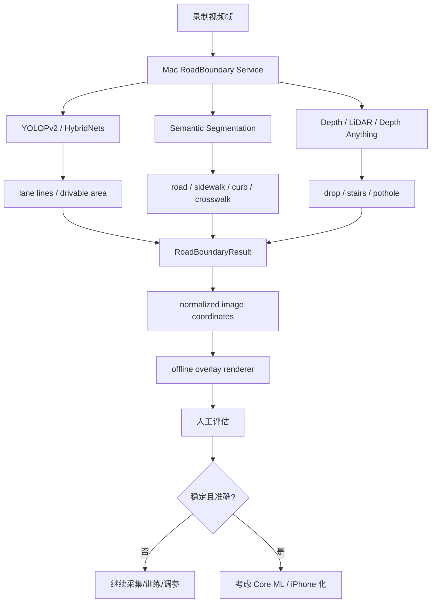

### RoadBoundaryResult 草案

```json
{
  "frame_id": "frame-0001",
  "coordinate_space": "normalized_image",
  "road_boundary": {
    "left_polyline": [[0.12, 0.88], [0.32, 0.38]],
    "right_polyline": [[0.88, 0.88], [0.68, 0.38]],
    "confidence": 0.72
  },
  "crosswalk": {
    "polygons": [],
    "confidence": 0.61
  },
  "lane_markings": [],
  "guidance_corridor": {
    "centerline": [[0.5, 0.9], [0.5, 0.4]],
    "status": "caution"
  }
}
```

---

## 9. 当前主要风险

| 风险 | 当前状态 | 下一步 |
|---|---|---|
| 水桶误检成车 | 已观察到 | 诊断录制 + 离线分析 + 模型评估 |
| 固定蓝线误导 | 已移除默认显示 | 未来只显示模型驱动路线/边界 |
| 道路边界不准 | 未真正解决 | Mac RoadBoundary prototype |
| Qwen 延迟高 | 仍存在 | 本地即时反馈 + ring buffer/latest-frame-wins |
| Overlay 坐标偏差 | 需真机验证 | 建立 preview transform 校准 |
| 台阶/坑洞 | 需要深度 | LiDAR / Depth Anything 实验 |

---

## 10. 乔布斯最终边界

VQASee 可以逐步成为“视觉风险辅助系统”，但只有在模型、时序、坐标对齐和评估集都验证后，才能显示真正的通行/行驶辅助路线。

当前版本允许：

- 显示检测框；
- 显示疑似边界/人行横道 cue；
- 本地即时提醒；
- 诊断录制；
- 离线分析。

当前版本不允许：

- 显示固定假轨迹并暗示可走；
- 说“可以走/可以开”；
- 把 YOLO11n 的 COCO 误检当道路理解能力；
- 让 Qwen 负责像素级道路边界。
