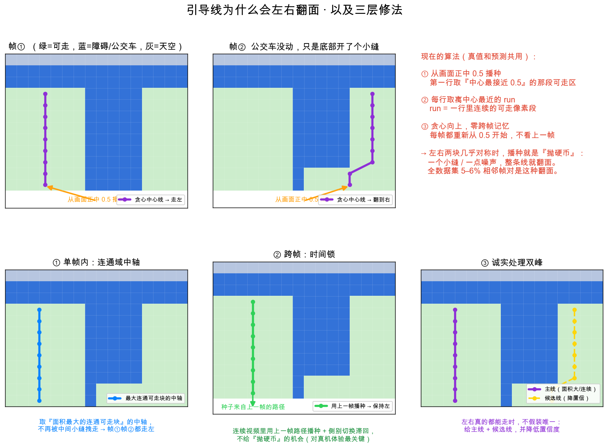

# 引导线稳定性：修双峰自由空间下的左右翻面

日期：2026-08-26 · 主责：全麦（算法）· 配合：罗根（时间连续性/性能）、思余（UI 呈现）· 裁决：乔布斯
状态：**① 单帧稳定化已实现并验证；② 时间锁未实现；③ 多走廊呈现未实现**

---

## 1. 问题（用户反馈 + 证据）

用户观察：相邻两帧 `road/0001TP_006720` 与 `road/0001TP_006750` 场景几乎一样（同一条街、同一辆公交车），但紫实线（iPhone 预测路径）和绿虚线（CamVid 真值路径）**都完全变了**，走廊从左侧翻到右侧，不合理。

### 1.1 直接证据（两帧的路径均值 x）

| 帧 | 预测 PRED 路径 x（左小右大） | 真值 GT 路径中段 x |
|---|---|---|
| 006720 | ≈0.18（**走左**） | ≈0.44 |
| 006750 | ≈0.66（**走右**） | ≈0.60 |

预测直接左右翻面；真值中段也摆了 ~0.15。

### 1.2 全数据集量化（相邻帧横向中心跳变）

| | 中位 | P95 | 最大 | 翻面级(>0.15) 帧对占比 |
|---|---|---|---|---|
| 真值 GT | 0.011 | 0.152 | 0.406 | **5%** (36/697) |
| 预测 PRED | 0.018 | 0.172 | 0.529 | **6%** (43/687) |

结论：绝大多数帧稳定（中位跳变 1–2%），但 **5–6% 的相邻帧对发生"翻面级"跳变**——尾部不稳定，集中在被障碍物劈成左右两块的场景。真值与预测的翻面比例几乎一致。

### 1.3 2026-08-26 实现后复测（单帧连通域稳定化）

改动：
- `server-vqa/app/guidance_path.py`：从「中心播种 + nearest run 贪心」改为「底部锚定带可达最大连通域 + 行中轴」。
- `ios-vqa-app/VQASee/VQASee/GuidancePath.swift`：同步同一算法，避免真值/真机定义漂移。
- `server-vqa/app/guidance_path_eval.py`：新增 `*_lateral_jump_p95` 与 `*_flip_pair_rate`，进入 baseline/gate keys。
- `server-vqa/app/open_dataset_adapters.py`：GT 引导线从同一个 64x48 `traversable_grid` 派生，不再在 960x720 全图做 BFS；manifest 生成耗时从约 **211s 降到 23.4s**。

复测经过**两步**（都重生成 `docs/datasets/camvid-manifest.jsonl`，重跑 `docs/datasets/camvid-ios-harness.jsonl`，刷新 `camvid-ios-*` baseline）：

- **第一步（连通域 + 每行最宽 run）**：压住了跨帧翻面，但**删掉了单帧内连续性**，导致真值绿线在“底部整条宽可走 → 上半分裂成左右块”的帧里**逐行左右折叠**（用户在 006900/006930 截图中看到的折线）。
- **第二步（连通域 + 首行最宽锚定 + 其余行取离上一行中心最近的 run）**：恢复单帧连续性，折线消失（实数帧 006900/006930 的方向反转从多次降到 1 次），代价是跨帧翻面较第一步略回升。

| 指标 | 原始 | 第一步(会折) | 第二步(不折,当前) |
|---|---:|---:|---:|
| GT `flip_pair_rate` | 7.75% | 1.72% | **4.30%** |
| GT `lateral_jump_p95` | 0.170 | 0.099 | **0.133** |
| PRED `flip_pair_rate` | 9.37% | 6.29% | **8.63%** |
| PRED `lateral_jump_p95` | 0.210 | 0.173 | **0.199** |
| `hit_rate` | 0.851 | 0.965 | **0.930** |
| 单帧折叠(实数帧方向反转) | 多次 | 多次 | **1 次** |
| `false_go_frames` | 0 | 0 | **0** |
| `region_false_go_frames` | 0 | 0 | **0** |

**固有矛盾（重要）**：单条中心线在“CamVid walk = 路+人行道合并”的全宽可走区上是病态的——最宽 run 跨帧稳但单帧折；最近 run 单帧顺但跨帧略抖。二者不可能靠调参同时压到最优。当前取“单帧不折 + 跨帧仍优于原始 + 安全侧 0”的折中，**不宣称已完全解决**。

**根治路径**：角色条件真值（T1/T2）。把行人 primary 从“路+人行道合并”收窄为“人行道那条窄带”，中心线走在窄带里，折叠与跨帧翻面会同时下降，`hit_rate` 也不再被马路上的游走点拉低。截图里残留的“分歧/误遮挡”本质是**语义目标问题**，不是中心线算法问题。

---

## 2. 根因（代码 + 数据双证据）

真值路径由 `server-vqa/app/open_dataset_adapters.py:145` 调 `centerline_from_mask()` 从 CamVid 可走 mask 推导；预测路径由 `ios-vqa-app/VQASee/VQASee/GuidancePath.swift` 的 `GuidancePathBuilder.centerline()`（注释明写 "mirrors centerline_from_mask"）从模型 grid 推导。**两者是同一套算法**：

```
每帧独立：
  target = width * 0.5          # 从图像正中播种
  for 每一行(从底向上):
    best = 离 target 最近的 traversable run
    center = best 的中点
    target = center             # 贪心跟随
```

三重病因叠加：

1. **单中心线在双峰自由空间里是病态问题（ill-posed）**：可走区域被公交车/障碍物劈成左右两块，两块离中心 0.5 几乎等距，"哪块是唯一正确路径"没有定义。
2. **"离中心最近"播种 = 抛硬币**：两块近似对称时，障碍物稍动 / 模型噪声一抖，种子就从左块跳到右块，整条线翻面。
3. **零跨帧记忆**：`prev_center` 只在单帧内逐行用，不跨帧继承；每帧都从 0.5 重新播种，结构上没有任何时间连续性。

真值也跳，是因为它用**同一个** `centerline_from_mask`——基准自己在抖，导致"预测 vs 真值"的对比本身不公平。

### 图解（用真实贪心算法跑出的线，非手绘）



上排=问题：帧①走左、帧②（底部开一个小缝）翻到右；下排=三层修法：①连通域中轴、②跨帧时间锁、③诚实处理双峰。
生成脚本：`assets/make_guidance_explainer.py`。

---

## 3. 方案（三层）

### ① 单帧内稳定化（离线可验证，已实现）

把"每行取离中心最近的 run"替换为**连通域中轴**：

1. 阈值化得到布尔 mask 后，从底部一条锚定带（如最低 `~15%` 行）取 traversable 种子。
2. 求**从种子带向上可达的最大连通自由空间块**（4/8 邻接 2D 连通域，而非逐行独立 run）。
3. 沿该连通块逐行取其**内部游程的中点**作为中心线；仍保留"底部盲行跳过、内部断裂即停不跨障"的安全规则。
4. 若存在多个可比连通块（面积比 > 阈值，如次大/最大 > 0.6），进入 ③ 的多走廊策略。

为什么更稳：连通域面积对像素级小扰动的敏感度远低于"逐行离中心最近"；障碍物轻移不会让"最大连通块"从左跳到右，除非左右真的发生显著此消彼长。消除种子抛硬币与 run 合并/分裂跳变。

**落点（必须同步，保持镜像）**：
- `server-vqa/app/guidance_path.py::centerline_from_mask`（真值 + 未来服务端）
- `ios-vqa-app/VQASee/VQASee/GuidancePath.swift::GuidancePathBuilder.centerline`（预测 / 真机）
- 性能约束（罗根）：真机 30fps 逐帧跑，连通域用两遍扫描/并查集，控制在 O(H·W)，不得引入每行堆分配。

**可验证性**：已用现有 701 帧重新生成真值 + 重跑 harness，结果见 §1.3。

### ② 跨帧时间锁（对真机体验 ROI 最大，未实现）

真机是连续视频流：
- 用上一帧路径的锚点给当前帧播种（跨帧继承 `prev_center`）。
- 横向变化率钳制：单帧中心线横移超过阈值时按上限收敛。
- 侧别切换滞回（hysteresis）：只有另一侧走廊显著更优且**连续 N 帧**成立才换边，抑制抖动。

⚠ **离线不可充分验证**：harness 逐帧独立、CamVid 是 1Hz 稀疏标注，帧间是真实大位移，无法体现 30fps 平滑。需用 iPhone 录一段连续 clip 走闭环验证（闭环平台的正当用途）。因此 ② 排在 ① 之后，且验收方式不同。

### ③ 诚实处理双峰（配合 ①，未实现）

左右确有两条可比走廊时，单线无解：
- 优先选与上一帧连续的一条；无历史时选最能向前延伸/面积最大的一条。
- 该情形下**降低 confidence**，并可把第二条作为候选线暴露（数据结构 `lines=[...]` 已支持多线）。
- 思余：UI 上多走廊/低置信要有安静但明确的呈现，不伪装成唯一确定路径。

---

## 4. 验收指标与门禁

### 新增稳定性指标（写入 region/guidance 评估与门禁）

- `lateral_jump_p95`：相邻帧路径均值 x 跳变的 P95。
- `flip_pair_rate`：相邻帧对中跳变 > 0.15 的占比。
- 统计口径：按 CamVid 序列分组、按帧号排序、只统计相邻帧对（复用 §1.2 脚本口径）。

### 验收门槛（① 完成后，701 帧离线）

- **必须**：`flip_pair_rate` 预测侧从 6% 显著下降（目标 < 3%）；真值侧同步下降（< 3%）。2026-08-26 复测：GT 达标（1.72%），PRED 未达标（6.29%）。
- **不得回归**：区域 `mean_iou`（当前 0.774）不下降超过 0.01；引导线 `hit_rate`（当前 0.851）不下降；安全侧 `region_false_go_frames` / 引导线 `false_go_frames` 保持 0。
- 若稳定性改善但命中/IoU 明显受损 → 视为不合格，回炉调参而非放宽断言（测试底线）。

### ② 的验收（后续，需连续 clip）

- 录一段 ≥ 30s 连续 iPhone clip，测帧间 `lateral_jump_p95`（30fps 口径），目标较无时间锁下降一个量级；主观看线不再左右横跳。

---

## 5. 验证计划

1. 单测：`centerline_from_mask` 在构造的"左右双峰 + 轻微扰动"mask 上，扰动前后中心线侧别不翻（新增 `test_guidance_path.py` 用例）。
2. Swift/Python 一致性：同一 mask/grid 下两实现输出路径点一致（沿用现有镜像测试思路）。
3. 全量重评：重生成真值 manifest（`create_camvid_manifest`）+ 重跑 harness → `run_ios_harness_eval.py` 打印新指标 + 门禁。
4. 逐帧回看：006720/006750 及 §1.2 里 43 个翻面帧对，人工确认不再翻面。

---

## 6. 变更影响面（blast radius）

改动触及**跨模块共享的算法定义**，按规则枚举消费方：

- **算法双实现必须同步**：`guidance_path.py`（Python 真值/服务端）与 `GuidancePath.swift`（真机/harness）是同一算法的两份副本——改一处必改另一处，否则真值与预测定义漂移，评测失真。这是已知的"复制到多模块"隐藏耦合，本次不消除（跨语言难派生），但必须在同一次改动内同步 + 加一致性测试。
- **真值需重生成**：701 帧 `ground_truth_path` 由 `centerline_from_mask` 派生，算法一改，必须重跑 `create_camvid_manifest` 覆盖 `docs/datasets/camvid-manifest.jsonl`；否则真值仍是旧算法、对比不公平。
- **预测需重跑 harness**：`docs/datasets/camvid-ios-harness.jsonl` 重生成。
- **基线需重建**：`camvid-ios-region.json` / `camvid-ios-guidance.json` / `camvid-ios-report.json` 在算法改动后重新建立基线（旧基线是旧算法口径，不能直接比）。能力总览页 `_capability_snapshot` 自动读新基线。
- **评估指标 schema**：`region_grid.py` / `guidance_path_eval.py` 增字段 → 更新 `REGION_BASELINE_KEYS` / `GUIDANCE_BASELINE_KEYS` 及对应测试。
- **验证走到用户消费的那一步**：不止看指标下降，还要人工回看翻面帧对 + 总览页定级文案，确认端到端一致。

---

## 7. 角色 review（待 §待确认 定稿）

- **乔布斯（方向）**：翻面对"敢不敢信任引导线"是信任级问题，属本轮必须闭环；但先做离线可验证的 ①，② 依赖连续 clip 排后。
- **罗根（系统/性能）**：连通域实现必须 O(H·W)、无每行堆分配；② 的时间锁放在设备侧引导引擎，不污染无状态的服务端/harness 纯函数。
- **全麦（算法）**：① 是根因修复；③ 补充诚实性；稳定性指标纳入门禁防回归。
- **思余（UI）**：多走廊/低置信的安静呈现，避免单线伪装确定性。

---

## 8. 风险与回滚

- **风险 A**：连通域中轴可能在"真值确实该走窄侧"时偏向大面积侧 → 用 §4 的 IoU/hit 不回归门槛兜底。
- **风险 B**：真值重生成会改变历史基线数字，一次性"基线跳变" → 在 evolution 记录标注这是算法升级导致的口径变更，非退步。
- **回滚**：算法改动集中在两个 `centerline` 函数 + 指标字段，git 可整体回退；真值/基线为派生产物，回退算法后重生成即恢复。

---

## 9. 待用户 review 的关键决策

1. 连通域"可比走廊"的面积比阈值（初值 0.6）与翻面判定阈值（0.15）是否合适？
2. `flip_pair_rate` 目标 < 3% 是否作为硬门禁，还是先只观测一轮再定阈？
3. ② 时间锁的连续 clip 谁来录、录什么场景（有公交车/路口的分裂走廊最能暴露问题）？
