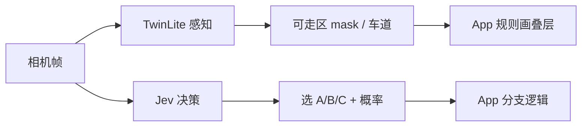

# 技术雷达：Jev / 决策型模型 vs TwinLite 感知

- 日期：2026-09-29
- 小马结论：**L1 学习更新**（接口范式值得记；**不**替代 TwinLite 主链路）
- 相关角色：乔布斯 / 罗根 / 思余 / 全麦
- 触发：用户问「Jev 是不是又一个更快的 TwinLite」——结论：**不是**

## 1. 来源与可信度

| 来源 | 类型 | 可信度 | 备注 |
| --- | --- | --- | --- |
| [TypeSafe：System One + Jev 发布](https://typesafe.ai/blog/introducing-system-one-models-and-jev) | 厂商博客 | 中高（产品声明） | 权重/架构未开源；「不能幻觉」= 只能从候选项里选，不是几何真值 |
| [Awesome Jev](https://awesomejev.com/) | 社区索引 | 中 | API 形状、延迟/定价声明汇总；非独立评测 |
| [Victor Dibia：How Jev works](https://victordibia.com/explainers/jev/) | 技术解读 | 中高 | 校准/ECE 证据缺口；开源复现是「接口形状」非 RLCD |
| [System One：Jev architecture](https://systemonemodels.org/guides/jev-architecture/) | 社区指南 | 中 | 明确：参数量、骨干、训练数据均未公开 |
| [Visual Jev arXiv:2609.25845](https://arxiv.org/abs/2609.25845) / [PDF](https://arxiv.org/pdf/2609.25845) | 论文 | 高（方法可复现陈述） | 共享视觉前缀 + batch 后缀；N=32 暖启动约 **8.9×** vs 串行；骨干多为 Qwen3-VL 级 + LoRA |
| TwinLiteNet / VQASee 现状 | 产品代码 + CURRENT | 高 | 本地 Core ML：可走区 + 车道叠层主航道 |

## 2. 核心认知

### 2.1 Jev 是什么（强制选择题式决策接口）

圈内最近火的 **Jev**（TypeSafe AI 的 **System One**；视觉侧有独立学术线 **Visual Jev** / **PixelJev**，arXiv 2026-09）指的是：

- **输入**：状态 / 图像 + **程序已定好的候选项**（Choice / Score / Noul 等 typed questions）
- **输出**：**结构化选择 + 概率**，给代码直接分支，而不是长文聊天
- **「快」主要来自**：不做自回归长文；视觉上还可 **图像前缀只算一次，多道题 batch 后缀**（Visual Jev：N=32 时相对串行约 8.9× 暖启动加速）
- **骨干**：往往是 **Qwen3-VL 等 VLM + LoRA / 专用决策读出**，不是 0.4M 级边缘分割网

它**不是**「又一个更快的 TwinLite」。

### 2.2 和 TwinLite 的本质区别

| 维度 | TwinLite（感知） | Jev / Visual Jev（决策） |
|------|------------------|--------------------------|
| 问的问题 | 每个像素是什么（路/线） | 在给定选项里选哪个 / 风险多高 |
| 输出 | 稠密几何（mask、折线） | 离散标签 + 校准概率（厂商主张） |
| 「快」含义 | 小 CNN、ANE 实时叠层 | 少 decode、共享视觉前缀、不做聊天 |
| 能否替代对方 | 不能直接输出「能不能走」的法律责任 | 不能直接画出可靠车道几何 |
| VQASee 位置 | **本地看路主链路** | 更像远程 Qwen 的「结构化版」或 Agent 路由 |

形象说法：TwinLite 是 **画地图的测绘员**；Jev 是 **只回答「左转还是右转」的裁判**——裁判快，是因为不画地图。

### 2.3 「决策型」在手机摄像头场景的三层谱系

避免和自动驾驶「端到端控车」混为一谈：

| 层 | 代表 | 功能 | iPhone / VQASee |
| --- | --- | --- | --- |
| **1. 程序化决策接口（Jev 族）** | Jev / Visual Jev / PixelJev / OpenJev·SemIf 类复现 | 工作流选择、是否相关、是否升级、同图多题批答 | 偏 **云端 / 本机大 VLM**；4B+ 难当 5 Hz 叠层主引擎；可作低频「设置里远程解释」的结构化出口 |
| **2. 轻量感知→规则决策（现状）** | TwinLite + YOLO + RiskLatch / 路径引擎 | 叠层、近障提示、语音升降级 | **Core ML 真机主航道** |
| **3. 端到端规划/世界模型（研究向）** | Drive-JEPA / Auto-JEPA、Hydra-MDP 类 | 图像→轨迹/控制 | 责任与安全验证完全不同；与 CURRENT「辅助不接管」冲突；**勿当 App 默认** |

另附端上相关但**非** Jev 的「快视觉」：Apple FastVLM / MobileCLIP（检索与短答）、Places/EfficientNet 场景门闩、Depth Anything Small——偏感知或轻分类，不是 Jev 式 typed decision。

## 3. 对 VQASee 的机会

- **解决哪个瓶颈**：主要是「说得对 / 产品闭环」里的 **远程结构化出口**；不是「反应快」的本地叠层。
- **可能收益**：
  - 远程 VQA 从「自由文本」收成「选项 + 概率」，便于 UI 分支、语音升降级、日志可测。
  - Visual Jev 思路：同帧多题（场景门闩 / 是否升级 / 出口方向）共享视觉前缀，省重复 encode。
- **适用场景**：室内通道「出口方向选择题」、是否相关/是否升级 Agent 路由；**不适用**户外车道几何。

## 4. 风险与不确定性

- **技术风险**：TypeSafe Jev 权重未开；「校准概率」缺公开 ECE/可靠性图；开源复现多是接口形状，≠ 厂商 RLCD。
- **产品风险**：把决策模型当「能不能走」会越界；与「辅助而非接管」冲突。
- **系统/性能风险**：VLM 级骨干在 5 Hz 叠层预算内不现实；误当主引擎会拖垮实时性。
- **数据/评测风险**：决策准确 ≠ 几何 IoU；不能用 CamVid/BDD 像素指标验收 Jev 族。

## 5. 分角色学习卡

### 乔布斯

- **产品影响**：Jev ≠ TwinLite；不要用「更快决策模型」叙事替换户外看路几何。
- **路线图/闭环影响**：若做实验，定位为远程解释通道的结构化 API，与本地叠层解耦（对齐室内/户外分通道）。
- **下一次要多问的问题**：这道题的候选项是谁定的？选错时用户看到什么失败态？

### 罗根

- **系统/性能影响**：Jev「快」是少 token / 共享前缀，不是 ANE 小 CNN；延迟预算要与远程/低频路径对齐。
- **需要观测的指标**：若实验：同帧多题的 prefix 复用耗时、p95、失败可见路径。
- **下一次要多问的问题**：这调用是本地 5 Hz 还是远程 2 s？堵采集队列了吗？

### 思余

- **UI/体验影响**：决策输出适合短状态 / 选项确认，不适合画假车道。
- **用户理解风险**：概率条易被读成「可以走」——文案必须保持提醒语气。
- **下一次要多问的问题**：选项 UI 是否比长答更安静、更可恢复？

### 全麦

- **模型/评测/推理影响**：可把「Choice + 概率」记为远程 schema 候选；骨干仍是 VLM 级，非 TwinLite 替身。
- **需要的样例和指标**：固定选项集上的准确率 / 校准；与现 Qwen 自由文本对照延迟与可解析率。
- **下一次要多问的问题**：最小实验用 OpenJev 形状 + 现有 Qwen，还是等 Visual Jev 开源复现？

## 6. 最小实验（未执行；L1 仅记录）

- **假设**：远程 VQA 用固定选项 + 概率，比自由文本更易测、更易做 UI 分支；**不**改善车道 IoU。
- **改动范围**：文档与可选后端 schema 草案；**不改**本地 TwinLite 路径。
- **Baseline**：现有远程 Qwen 自由回答 + 本地 TwinLite 叠层。
- **验证**：同图 3–5 道 typed 题（场景／是否升级／出口方向）；量延迟与可解析率；乔布斯看图仍以本地叠层为准。
- **成功标准**：选项可解析率 ↑、延迟不劣于自由文本；用户不把结果读成「可以走」。
- **失败退出**：需要上 4B+ 本地当 5 Hz 主引擎，或输出被当成几何替代 → 立刻停。

## 7. 对 VQASee 的建议（乔布斯可用）

1. **不要**用 Jev 替换 TwinLite 画车道。
2. **可以**把 Jev 风格记为：远程 VQA 的「选项+概率」接口实验（室内通道等），与本地几何解耦。
3. 真要「又快又决策」的端上第一步仍是：**场景门闩小分类器 + YOLO/深度**，不是上 4B VLM。

## 8. 沉淀与后续

- 是否更新 AGENTS.md：**否**（认知与 CURRENT「辅助不接管 / 本地感知主航道」一致，无需改宪法）
- 是否更新 skill：**否**（本轮 L1；若做远程 schema 实验再改 model-prompt-lab）
- 是否进入 docs/decisions：**否**
- 是否进入 docs/model-lab / performance / ui-lab：**否**（仅雷达）
- 是否进入 roadmap：**否**（可选 backlog：远程 typed decision schema）
- 下一次主动雷达主题：Places / EfficientNet 类 **场景门闩** on-device；OpenJev / Visual Jev 开源复现成熟度

## 9. 关联文档

- `docs/tech-radar/2026-09-23-indoor-ood-competitors-realtime.md`（室内分通道）
- `docs/CURRENT.md`（户外主战、辅助不接管）
- `auto_docs/jev-decision-vs-twinlite.md`（本轮短纪要）
